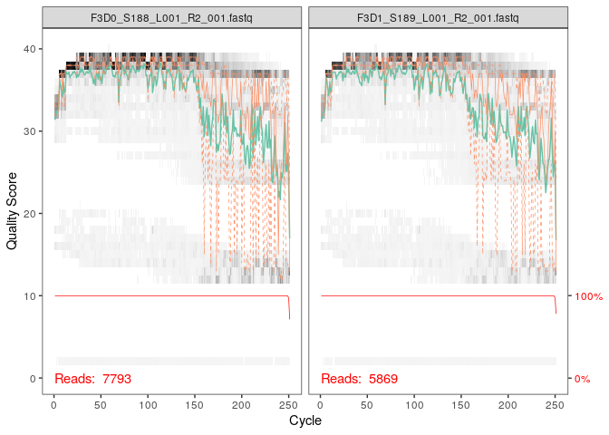

Dada2 tutorial
================

  - [Préparation](#préparation)
  - [Profils de qualité](#profils-de-qualité)
  - [Filtration des données](#filtration-des-données)
  - [Modèle d’erreur](#modèle-derreur)
  - [Inférence d’échantillon](#inférence-déchantillon)
  - [Fusionner les lectures
    appariées](#fusionner-les-lectures-appariées)
  - [Construire une table de
    séquence](#construire-une-table-de-séquence)
  - [Supprimer les chimères](#supprimer-les-chimères)
  - [Suivre les reads dans le
    pipeline](#suivre-les-reads-dans-le-pipeline)
  - [Assigniation taxonomique](#assigniation-taxonomique)
  - [Autre façon d’assigner une
    taxonomique](#autre-façon-dassigner-une-taxonomique)
  - [Evaluer la précision](#evaluer-la-précision)

# Préparation

``` r
library("dada2")
```

    ## Loading required package: Rcpp

``` r
# Définition du chemin d'accès du dossier MiSeq_SOP
path <- "~/projet_m1_mfa_tuto/MiSeq_SOP"
list.files(path)
```

    ##  [1] "F3D0_S188_L001_R1_001.fastq"   "F3D0_S188_L001_R2_001.fastq"  
    ##  [3] "F3D1_S189_L001_R1_001.fastq"   "F3D1_S189_L001_R2_001.fastq"  
    ##  [5] "F3D141_S207_L001_R1_001.fastq" "F3D141_S207_L001_R2_001.fastq"
    ##  [7] "F3D142_S208_L001_R1_001.fastq" "F3D142_S208_L001_R2_001.fastq"
    ##  [9] "F3D143_S209_L001_R1_001.fastq" "F3D143_S209_L001_R2_001.fastq"
    ## [11] "F3D144_S210_L001_R1_001.fastq" "F3D144_S210_L001_R2_001.fastq"
    ## [13] "F3D145_S211_L001_R1_001.fastq" "F3D145_S211_L001_R2_001.fastq"
    ## [15] "F3D146_S212_L001_R1_001.fastq" "F3D146_S212_L001_R2_001.fastq"
    ## [17] "F3D147_S213_L001_R1_001.fastq" "F3D147_S213_L001_R2_001.fastq"
    ## [19] "F3D148_S214_L001_R1_001.fastq" "F3D148_S214_L001_R2_001.fastq"
    ## [21] "F3D149_S215_L001_R1_001.fastq" "F3D149_S215_L001_R2_001.fastq"
    ## [23] "F3D150_S216_L001_R1_001.fastq" "F3D150_S216_L001_R2_001.fastq"
    ## [25] "F3D2_S190_L001_R1_001.fastq"   "F3D2_S190_L001_R2_001.fastq"  
    ## [27] "F3D3_S191_L001_R1_001.fastq"   "F3D3_S191_L001_R2_001.fastq"  
    ## [29] "F3D5_S193_L001_R1_001.fastq"   "F3D5_S193_L001_R2_001.fastq"  
    ## [31] "F3D6_S194_L001_R1_001.fastq"   "F3D6_S194_L001_R2_001.fastq"  
    ## [33] "F3D7_S195_L001_R1_001.fastq"   "F3D7_S195_L001_R2_001.fastq"  
    ## [35] "F3D8_S196_L001_R1_001.fastq"   "F3D8_S196_L001_R2_001.fastq"  
    ## [37] "F3D9_S197_L001_R1_001.fastq"   "F3D9_S197_L001_R2_001.fastq"  
    ## [39] "filtered"                      "HMP_MOCK.v35.fasta"           
    ## [41] "Mock_S280_L001_R1_001.fastq"   "Mock_S280_L001_R2_001.fastq"  
    ## [43] "mouse.dpw.metadata"            "mouse.time.design"            
    ## [45] "stability.batch"               "stability.files"

On a défini le chemin d’accès du dossier MiSeq\_SOP, on retrouvera donc
dans Path nos jeux de données.

``` r
# Forward and reverse fastq filenames have format: SAMPLENAME_R1_001.fastq and SAMPLENAME_R2_001.fastq = trie les fichiers
fnFs <- sort(list.files(path, pattern="_R1_001.fastq", full.names = TRUE))
fnRs <- sort(list.files(path, pattern="_R2_001.fastq", full.names = TRUE))
# Extract sample names, assuming filenames have format: SAMPLENAME_XXX.fastq = recupère le nom de l'échantillon
sample.names <- sapply(strsplit(basename(fnFs), "_"), `[`, 1)
```

On sépare maintenant nos 2 atributs (R1 et R2). Pour cela nous allons
créer la variable fnFs qui correspondra aux reads forward (R1) et fnRs
qui correspondra aux reads Reverse (R2).

La fonction sample.names \<- sapply(strsplit(basename(fnFs), "*"), `[`,
1) permet d’extraire le nom des échantillons des fichiers fnFs. Basename
supprime tout le chemin jusqu’au séparateur de dernier chemin. strsplit
divise tous les éléments du vecteur fnFs en sous-chaînes selon les *
(underscore) des sous-chaînes.

# Profils de qualité

``` r
# Affichage d'un graphique de score de qualité des sequences Forward
plotQualityProfile(fnFs[1:2])
```

<!-- -->
La fonction plot permet de tracer le grpahiqu du sore de qualité des
séquences Forward.

En abscisse nous avons la longueur des reads et en ordonnée nous avons
le score de qualité. Le gris correspond a la heat map de la féquence de
chaque score de qualité à chaque position de base. La ligne en vert
correspond au score de qualité moyen pour chaque position. La ligne en
orange correspond au quartile de la distribution du score de qualité. La
ligne en rouge correspond au seuil où le score de qualité est de 10.

On peut voir que le score de qualité est globalement de bonne qualité
mais ce score décroit et passe en dessous de Q30 au niveau de la 240 pb
pour R1.

``` r
# Affichage d'un graphique de score de qualité des sequences Reverse
plotQualityProfile(fnRs[1:2])
```

<!-- -->
Pour les reads Reverse la qualité est nettement moins bonne, en
particulier à la fin ce qui est courant dans le séquençage d’illumina.
Nous éliminons donc les nucléotides en position 160 où la distribution
de qualité est mauvaise.

# Filtration des données

``` r
# Place filtered files in filtered/ subdirectory
filtFs <- file.path(path, "filtered", paste0(sample.names, "_F_filt.fastq.gz"))
filtRs <- file.path(path, "filtered", paste0(sample.names, "_R_filt.fastq.gz"))
names(filtFs) <- sample.names
names(filtRs) <- sample.names
```

Ici on met nos données filtrées dans 2 objets : filtFs va donc contenir
les donées filtrées des reads forward et filtRs va contenir les données
filtrées des reads reverse.

``` r
out <- filterAndTrim(fnFs, filtFs, fnRs, filtRs, truncLen=c(240,160),
              maxN=0, maxEE=c(2,2), truncQ=2, rm.phix=TRUE,
              compress=TRUE, multithread=TRUE) # On Windows set multithread=FALSE
head(out)
```

    ##                               reads.in reads.out
    ## F3D0_S188_L001_R1_001.fastq       7793      7113
    ## F3D1_S189_L001_R1_001.fastq       5869      5299
    ## F3D141_S207_L001_R1_001.fastq     5958      5463
    ## F3D142_S208_L001_R1_001.fastq     3183      2914
    ## F3D143_S209_L001_R1_001.fastq     3178      2941
    ## F3D144_S210_L001_R1_001.fastq     4827      4312

On dépose maintenant nos données filtrées filtFs et filtRs dans l’objet
out. la fonction truncLen permet d’éliminer les nucléotides en position
160 et 240 pour conserver le meilleure score qualité pour les reads(au
dessus du Q30) mais cela permet également d’obtenir des reads de même
taille. TrimLeft et Right permettent d’enlever les adaptateurs de notre
jeu de données. maxEE permet de recalculer le Qscore moyen apres avoir
coupé une partie du read incriminé. MaxN=0 permet d’enlever toutes les
bases dans lesquelles il y aura un N (A,T,G ou C) dans un read d’un jeu
de données (le R1 et le R2).

# Modèle d’erreur

DADA2 calcul un model d’erreur à partir des données de séquençage. On
applique cette méthode sur les reads fw puis reverse

``` r
errF <- learnErrors(filtFs, multithread=TRUE)
```

    ## 33514080 total bases in 139642 reads from 20 samples will be used for learning the error rates.

``` r
errR <- learnErrors(filtRs, multithread=TRUE)
```

    ## 22342720 total bases in 139642 reads from 20 samples will be used for learning the error rates.

``` r
plotErrors(errF, nominalQ=TRUE)
```

    ## Warning: Transformation introduced infinite values in continuous y-axis
    
    ## Warning: Transformation introduced infinite values in continuous y-axis

<!-- -->
DADA2 analyse les variations de séquences et il va identifier et créer
un modèle d’erreur. Ce modèle d’erreur sera ensuite utiliser afin de
corriger les reads du jeu de données. Ce qu’on observe ici est un plot
du modèle d’erreur généré par DADA2. En abscisse nous avont le Qscore et
en ordonner la probabilité. On obtient donc la probabilité d’une
mutation en fonction du Qscore. Pour A2A, la pobabilité qu’un A devient
un A est très forte. Pour A2C, lorsque le Qscore est très élevé, la
probabilité qu’un A devient un C est faible. Si le Qscore est faible, la
probablité qu’un A donne un C est élevé.

# Inférence d’échantillon

``` r
dadaFs <- dada(filtFs, err=errF, multithread=TRUE)
```

    ## Sample 1 - 7113 reads in 1979 unique sequences.
    ## Sample 2 - 5299 reads in 1639 unique sequences.
    ## Sample 3 - 5463 reads in 1477 unique sequences.
    ## Sample 4 - 2914 reads in 904 unique sequences.
    ## Sample 5 - 2941 reads in 939 unique sequences.
    ## Sample 6 - 4312 reads in 1267 unique sequences.
    ## Sample 7 - 6741 reads in 1756 unique sequences.
    ## Sample 8 - 4560 reads in 1438 unique sequences.
    ## Sample 9 - 15637 reads in 3590 unique sequences.
    ## Sample 10 - 11413 reads in 2762 unique sequences.
    ## Sample 11 - 12017 reads in 3021 unique sequences.
    ## Sample 12 - 5032 reads in 1566 unique sequences.
    ## Sample 13 - 18075 reads in 3707 unique sequences.
    ## Sample 14 - 6250 reads in 1479 unique sequences.
    ## Sample 15 - 4052 reads in 1195 unique sequences.
    ## Sample 16 - 7369 reads in 1832 unique sequences.
    ## Sample 17 - 4765 reads in 1183 unique sequences.
    ## Sample 18 - 4871 reads in 1382 unique sequences.
    ## Sample 19 - 6504 reads in 1709 unique sequences.
    ## Sample 20 - 4314 reads in 897 unique sequences.

``` r
dadaRs <- dada(filtRs, err=errR, multithread=TRUE)
```

    ## Sample 1 - 7113 reads in 1660 unique sequences.
    ## Sample 2 - 5299 reads in 1349 unique sequences.
    ## Sample 3 - 5463 reads in 1335 unique sequences.
    ## Sample 4 - 2914 reads in 853 unique sequences.
    ## Sample 5 - 2941 reads in 880 unique sequences.
    ## Sample 6 - 4312 reads in 1286 unique sequences.
    ## Sample 7 - 6741 reads in 1803 unique sequences.
    ## Sample 8 - 4560 reads in 1265 unique sequences.
    ## Sample 9 - 15637 reads in 3414 unique sequences.
    ## Sample 10 - 11413 reads in 2522 unique sequences.
    ## Sample 11 - 12017 reads in 2771 unique sequences.
    ## Sample 12 - 5032 reads in 1415 unique sequences.
    ## Sample 13 - 18075 reads in 3290 unique sequences.
    ## Sample 14 - 6250 reads in 1390 unique sequences.
    ## Sample 15 - 4052 reads in 1134 unique sequences.
    ## Sample 16 - 7369 reads in 1635 unique sequences.
    ## Sample 17 - 4765 reads in 1084 unique sequences.
    ## Sample 18 - 4871 reads in 1161 unique sequences.
    ## Sample 19 - 6504 reads in 1502 unique sequences.
    ## Sample 20 - 4314 reads in 732 unique sequences.

L’objet dadaFs reçoit le modèle d’erreur pour les reads forward et
l’objet dadaRs reçoit le modèle d’erreur pour les reads revers Pour le
1er échantillon, on avait 7113 reads et 1660 séquence unique avant la
correction par DADA2.

``` r
dadaFs[[1]]
```

    ## dada-class: object describing DADA2 denoising results
    ## 128 sequence variants were inferred from 1979 input unique sequences.
    ## Key parameters: OMEGA_A = 1e-40, OMEGA_C = 1e-40, BAND_SIZE = 16

Grâce à cette commande nous pouvons inspecter dans l’objet dadaFs le 1er
“tirroire”.

# Fusionner les lectures appariées

Aligner les R1 et les R2 en un contigs

``` r
mergers <- mergePairs(dadaFs, filtFs, dadaRs, filtRs, verbose=TRUE)
```

    ## 6551 paired-reads (in 106 unique pairings) successfully merged out of 6907 (in 199 pairings) input.

    ## 5025 paired-reads (in 100 unique pairings) successfully merged out of 5188 (in 156 pairings) input.

    ## 4973 paired-reads (in 80 unique pairings) successfully merged out of 5268 (in 166 pairings) input.

    ## 2595 paired-reads (in 52 unique pairings) successfully merged out of 2756 (in 109 pairings) input.

    ## 2553 paired-reads (in 60 unique pairings) successfully merged out of 2785 (in 119 pairings) input.

    ## 3622 paired-reads (in 53 unique pairings) successfully merged out of 4103 (in 157 pairings) input.

    ## 6079 paired-reads (in 81 unique pairings) successfully merged out of 6515 (in 198 pairings) input.

    ## 3961 paired-reads (in 90 unique pairings) successfully merged out of 4384 (in 188 pairings) input.

    ## 14231 paired-reads (in 143 unique pairings) successfully merged out of 15358 (in 351 pairings) input.

    ## 10526 paired-reads (in 120 unique pairings) successfully merged out of 11166 (in 279 pairings) input.

    ## 11156 paired-reads (in 137 unique pairings) successfully merged out of 11799 (in 298 pairings) input.

    ## 4329 paired-reads (in 84 unique pairings) successfully merged out of 4788 (in 180 pairings) input.

    ## 17431 paired-reads (in 153 unique pairings) successfully merged out of 17812 (in 272 pairings) input.

    ## 5850 paired-reads (in 81 unique pairings) successfully merged out of 6095 (in 159 pairings) input.

    ## 3716 paired-reads (in 86 unique pairings) successfully merged out of 3894 (in 147 pairings) input.

    ## 6865 paired-reads (in 99 unique pairings) successfully merged out of 7193 (in 187 pairings) input.

    ## 4430 paired-reads (in 67 unique pairings) successfully merged out of 4605 (in 127 pairings) input.

    ## 4574 paired-reads (in 100 unique pairings) successfully merged out of 4736 (in 172 pairings) input.

    ## 6094 paired-reads (in 109 unique pairings) successfully merged out of 6314 (in 172 pairings) input.

    ## 4269 paired-reads (in 20 unique pairings) successfully merged out of 4281 (in 28 pairings) input.

``` r
# Inspect the merger data.frame from the first sample
head(mergers[[1]])
```

    ##                                                                                                                                                                                                                                                       sequence
    ## 1 TACGGAGGATGCGAGCGTTATCCGGATTTATTGGGTTTAAAGGGTGCGCAGGCGGAAGATCAAGTCAGCGGTAAAATTGAGAGGCTCAACCTCTTCGAGCCGTTGAAACTGGTTTTCTTGAGTGAGCGAGAAGTATGCGGAATGCGTGGTGTAGCGGTGAAATGCATAGATATCACGCAGAACTCCGATTGCGAAGGCAGCATACCGGCGCTCAACTGACGCTCATGCACGAAAGTGTGGGTATCGAACAGG
    ## 2 TACGGAGGATGCGAGCGTTATCCGGATTTATTGGGTTTAAAGGGTGCGTAGGCGGCCTGCCAAGTCAGCGGTAAAATTGCGGGGCTCAACCCCGTACAGCCGTTGAAACTGCCGGGCTCGAGTGGGCGAGAAGTATGCGGAATGCGTGGTGTAGCGGTGAAATGCATAGATATCACGCAGAACCCCGATTGCGAAGGCAGCATACCGGCGCCCTACTGACGCTGAGGCACGAAAGTGCGGGGATCAAACAGG
    ## 3 TACGGAGGATGCGAGCGTTATCCGGATTTATTGGGTTTAAAGGGTGCGTAGGCGGGCTGTTAAGTCAGCGGTCAAATGTCGGGGCTCAACCCCGGCCTGCCGTTGAAACTGGCGGCCTCGAGTGGGCGAGAAGTATGCGGAATGCGTGGTGTAGCGGTGAAATGCATAGATATCACGCAGAACTCCGATTGCGAAGGCAGCATACCGGCGCCCGACTGACGCTGAGGCACGAAAGCGTGGGTATCGAACAGG
    ## 4 TACGGAGGATGCGAGCGTTATCCGGATTTATTGGGTTTAAAGGGTGCGTAGGCGGGCTTTTAAGTCAGCGGTAAAAATTCGGGGCTCAACCCCGTCCGGCCGTTGAAACTGGGGGCCTTGAGTGGGCGAGAAGAAGGCGGAATGCGTGGTGTAGCGGTGAAATGCATAGATATCACGCAGAACCCCGATTGCGAAGGCAGCCTTCCGGCGCCCTACTGACGCTGAGGCACGAAAGTGCGGGGATCGAACAGG
    ## 5 TACGGAGGATGCGAGCGTTATCCGGATTTATTGGGTTTAAAGGGTGCGCAGGCGGACTCTCAAGTCAGCGGTCAAATCGCGGGGCTCAACCCCGTTCCGCCGTTGAAACTGGGAGCCTTGAGTGCGCGAGAAGTAGGCGGAATGCGTGGTGTAGCGGTGAAATGCATAGATATCACGCAGAACTCCGATTGCGAAGGCAGCCTACCGGCGCGCAACTGACGCTCATGCACGAAAGCGTGGGTATCGAACAGG
    ## 6 TACGGAGGATGCGAGCGTTATCCGGATTTATTGGGTTTAAAGGGTGCGTAGGCGGGATGCCAAGTCAGCGGTAAAAAAGCGGTGCTCAACGCCGTCGAGCCGTTGAAACTGGCGTTCTTGAGTGGGCGAGAAGTATGCGGAATGCGTGGTGTAGCGGTGAAATGCATAGATATCACGCAGAACTCCGATTGCGAAGGCAGCATACCGGCGCCCTACTGACGCTGAGGCACGAAAGCGTGGGTATCGAACAGG
    ##   abundance forward reverse nmatch nmismatch nindel prefer accept
    ## 1       579       1       1    148         0      0      1   TRUE
    ## 2       470       2       2    148         0      0      2   TRUE
    ## 3       449       3       4    148         0      0      1   TRUE
    ## 4       430       4       3    148         0      0      2   TRUE
    ## 5       345       5       6    148         0      0      1   TRUE
    ## 6       282       6       5    148         0      0      2   TRUE

Nous avons une table d’observation permettant de savoir combien de
séquence nous avons dans chaques échantillons. La commande mergePairs
permet la formation de contigs seulement quand cela est possible, il
faut au moins 12 paires de bases identiques et qui se chevauche entre
les 2 reads.

# Construire une table de séquence

``` r
# Fait une table de sequence et l'affiche
seqtab <- makeSequenceTable(mergers)
dim(seqtab)
```

    ## [1]  20 293

On a créer un objet seqtable et de dans on y met une matrice
d’observation de l’objet mergers grâce a la fonction
makeSequenceTable. la fonction dim permet d’avoir la dimension du
tableau. Cela permet de voir combien de fois on peut retrouver une
séquence dans un échantillon.

``` r
# Inspecte la distribution des longueurs de séquence
table(nchar(getSequences(seqtab)))
```

    ## 
    ## 251 252 253 254 255 
    ##   1  88 196   6   2

A partir de seqtab on va pouvoir savoir combien de fois on retrouve une
séquence a une certaine longueur en nucléotide. par exemple ici on voit
qu’il y a une séquence faisant 251 nucléotides. La majorité des
séquences font 253 nucléotides.

# Supprimer les chimères

Une séquence chimère est une séquence d’ADN polymérisé par PCR mais qui
n’a pas fini de se polymériser.

``` r
seqtab.nochim <- removeBimeraDenovo(seqtab, method="consensus", multithread=TRUE, verbose=TRUE)
```

    ## Identified 61 bimeras out of 293 input sequences.

``` r
dim(seqtab.nochim)
```

    ## [1]  20 232

Les séquences chimériques doivent être éliminés du jeu de données sinon
cela peut entrainer des erreurs lors de nos analyses, il faut également
éliminer les primers car ces primers peuvent être consisdérer comme des
séquences chimériques. l’objet seqtab.nochim est créée dans lequel la
fonction removeBineraDenovo permet de supprimer les séquences
chimériques. Ici nous avons identifié 61 chimères sur les 293
séquences.

``` r
sum(seqtab.nochim)/sum(seqtab)
```

    ## [1] 0.964263

Il y avait 4% des séquences qui était des séquences chimérique, celle ci
ont donc était retiré du jeu de données.

# Suivre les reads dans le pipeline

``` r
getN <- function(x) sum(getUniques(x))
track <- cbind(out, sapply(dadaFs, getN), sapply(dadaRs, getN), sapply(mergers, getN), rowSums(seqtab.nochim))
# If processing a single sample, remove the sapply calls: e.g. replace sapply(dadaFs, getN) with getN(dadaFs)
colnames(track) <- c("input", "filtered", "denoisedF", "denoisedR", "merged", "nonchim")
rownames(track) <- sample.names
head(track)
```

    ##        input filtered denoisedF denoisedR merged nonchim
    ## F3D0    7793     7113      6996      6978   6551    6539
    ## F3D1    5869     5299      5227      5239   5025    5014
    ## F3D141  5958     5463      5339      5351   4973    4850
    ## F3D142  3183     2914      2799      2833   2595    2521
    ## F3D143  3178     2941      2822      2868   2553    2519
    ## F3D144  4827     4312      4146      4224   3622    3483

Ici nous pouvons vérifier et analyser le nombre de reads effectuées à
chaques étape afin de vérifier qu’il n’y a pas trop de perte. On peut
voir qu’il n’y a pas trop de perte associé a chaque étape.

# Assigniation taxonomique

Nous allons assigner une taxonomie à nos taxons grâce à silva. Cette
assignation taxonomique est déposée dans l’objet taxa.

``` r
# Assigniation Taxonomique
taxa <- assignTaxonomy(seqtab.nochim, "~/projet_m1_mfa_tuto/silva_nr99_v138_train_set.fa.gz", multithread=TRUE)
```

On créer un tableau taxa en comparant nos données à un jeu de données
“Silva nr v 132” présent dans le path
\~/projet\_m1\_mfa\_tuto/MiSeq\_SOP/. On obtient un assignement jusqu’au
genre.

``` r
taxa <- addSpecies(taxa, "~/projet_m1_mfa_tuto/silva_species_assignment_v138.fa.gz")
```

``` r
taxa.print <- taxa # Removing sequence rownames for display only
rownames(taxa.print) <- NULL
head(taxa.print)
```

    ##      Kingdom    Phylum         Class         Order           Family          
    ## [1,] "Bacteria" "Bacteroidota" "Bacteroidia" "Bacteroidales" "Muribaculaceae"
    ## [2,] "Bacteria" "Bacteroidota" "Bacteroidia" "Bacteroidales" "Muribaculaceae"
    ## [3,] "Bacteria" "Bacteroidota" "Bacteroidia" "Bacteroidales" "Muribaculaceae"
    ## [4,] "Bacteria" "Bacteroidota" "Bacteroidia" "Bacteroidales" "Muribaculaceae"
    ## [5,] "Bacteria" "Bacteroidota" "Bacteroidia" "Bacteroidales" "Bacteroidaceae"
    ## [6,] "Bacteria" "Bacteroidota" "Bacteroidia" "Bacteroidales" "Muribaculaceae"
    ##      Genus         Species
    ## [1,] NA            NA     
    ## [2,] NA            NA     
    ## [3,] NA            NA     
    ## [4,] NA            NA     
    ## [5,] "Bacteroides" NA     
    ## [6,] NA            NA

Ici nous pouvons inspecter les affectations taxonomiques. Les
Bacteroidetes sont les taxons les plus abondants dans ces échantillons.
Les attributions vont rarement jusqu’à l’espèce car il est souvent
impossible de faire des assignations d’espèces sans ambiguité à partir
d’un fragment du gène 16S. L’assignation s’arrête donc souvent à la
famille et rarement au genre.

# Autre façon d’assigner une taxonomique

On peut utiliser la commande ci-dessous pour également faire une
assignation taxonomique en utilisant une base de données de silva.

``` r
taxa <- addSpecies(taxa, "~/projet_m1_mfa_tuto/silva_species_assignment_v138.fa.gz")
```

``` r
taxa.print <- taxa # Removing sequence rownames for display only
rownames(taxa.print) <- NULL
head(taxa.print)
```

    ##      Kingdom    Phylum         Class         Order           Family          
    ## [1,] "Bacteria" "Bacteroidota" "Bacteroidia" "Bacteroidales" "Muribaculaceae"
    ## [2,] "Bacteria" "Bacteroidota" "Bacteroidia" "Bacteroidales" "Muribaculaceae"
    ## [3,] "Bacteria" "Bacteroidota" "Bacteroidia" "Bacteroidales" "Muribaculaceae"
    ## [4,] "Bacteria" "Bacteroidota" "Bacteroidia" "Bacteroidales" "Muribaculaceae"
    ## [5,] "Bacteria" "Bacteroidota" "Bacteroidia" "Bacteroidales" "Bacteroidaceae"
    ## [6,] "Bacteria" "Bacteroidota" "Bacteroidia" "Bacteroidales" "Muribaculaceae"
    ##      Genus         Species Species
    ## [1,] NA            NA      NA     
    ## [2,] NA            NA      NA     
    ## [3,] NA            NA      NA     
    ## [4,] NA            NA      NA     
    ## [5,] "Bacteroides" NA      NA     
    ## [6,] NA            NA      NA

# Evaluer la précision

``` r
# Évaluation de la précision de DADA2 dans la communauté Mock
unqs.mock <- seqtab.nochim["Mock",]
unqs.mock <- sort(unqs.mock[unqs.mock>0], decreasing=TRUE) # Drop ASVs absent in the Mock
cat("DADA2 inferred", length(unqs.mock), "sample sequences present in the Mock community.\n")
```

    ## DADA2 inferred 20 sample sequences present in the Mock community.

Grâce à cette commande on peut savoir combien il y a de séquences
uniques dans notre échantillon, ici il y en a 20 dans The Mock
community.

``` r
mock.ref <- getSequences(file.path(path, "HMP_MOCK.v35.fasta"))
match.ref <- sum(sapply(names(unqs.mock), function(x) any(grepl(x, mock.ref))))
cat("Of those,", sum(match.ref), "were exact matches to the expected reference sequences.\n")
```

    ## Of those, 20 were exact matches to the expected reference sequences.

le fichier HMP\_MOCK.v35.fasta est déposé dans l’objet mock.ref. DADA2 a
identifié 20 ASV qui correspondent exactement aux génome de référence
des membres de la communauté.

``` r
# Sauvegarde des données dans l'environnement afin de les réutiliser
save.image(file="02_data-analysis-with-DADA2_FinalEnv")
```
