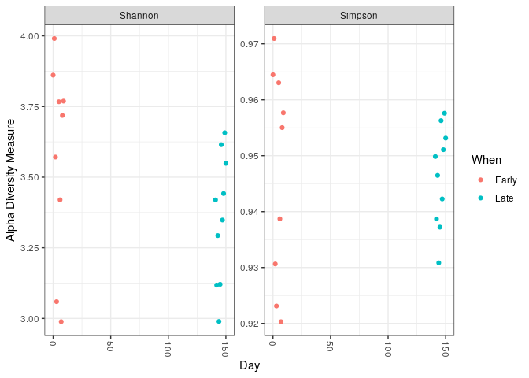
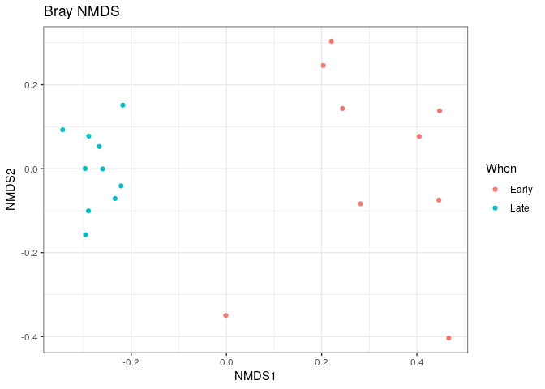
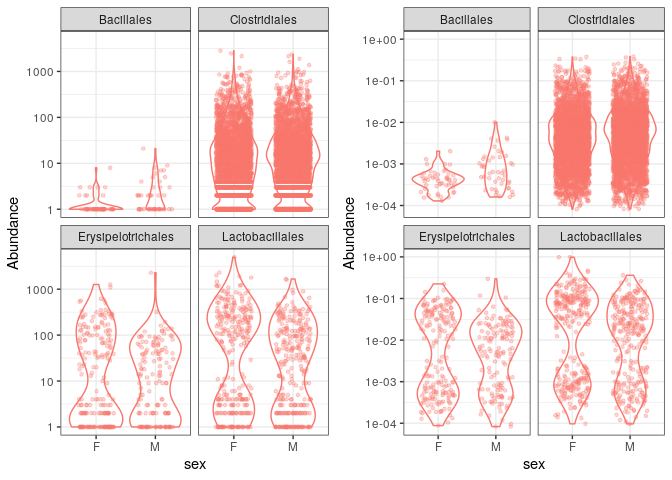
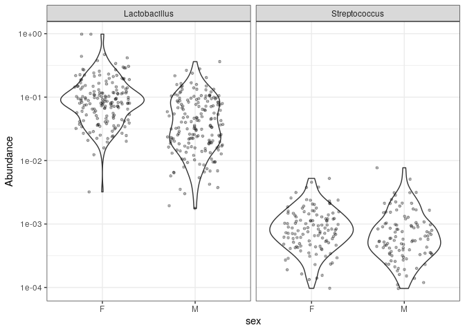
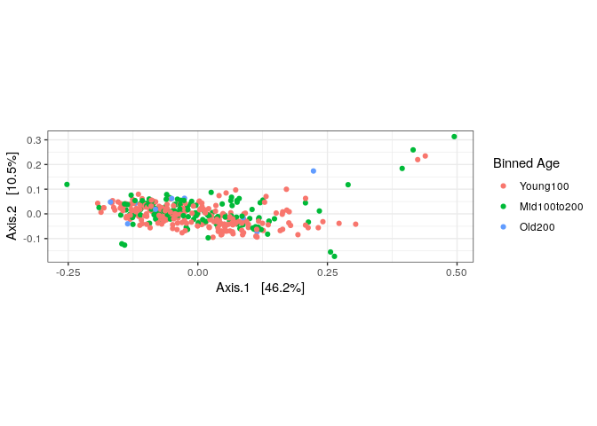
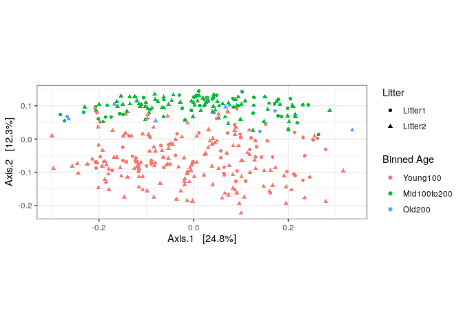
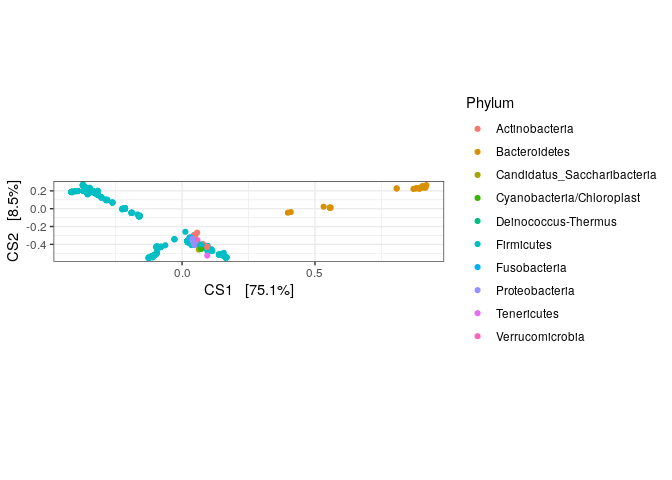
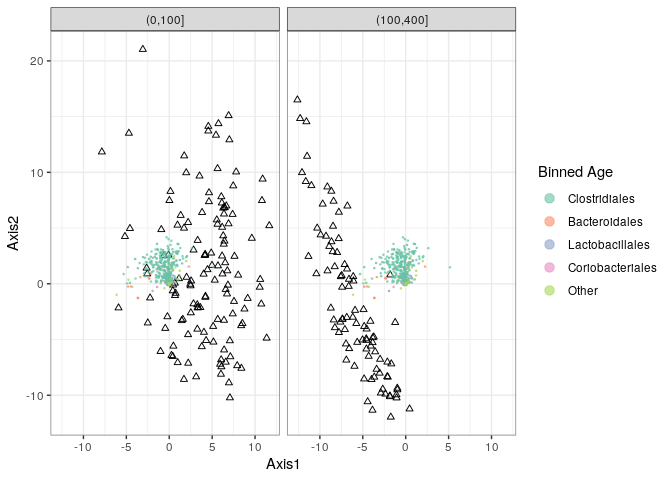

phyloseq
================

  - [Importer dans phyloseq](#importer-dans-phyloseq)
      - [Visualisation de la diversité
        alpha](#visualisation-de-la-diversité-alpha)
  - [Chargement des données](#chargement-des-données)
  - [Filtrage taxonomique](#filtrage-taxonomique)
  - [Taxons agglomérés](#taxons-agglomérés)
      - [Prétraitement](#prétraitement)
  - [Différentes projections
    d’ordination](#différentes-projections-dordination)
  - [Pourquoi les tracés d’ordination sont-ils si éloignés de la place
    ?](#pourquoi-les-tracés-dordination-sont-ils-si-éloignés-de-la-place)
      - [PCA sur les rangs](#pca-sur-les-rangs)
      - [Correspondance canonique](#correspondance-canonique)
  - [Apprentissage supervisé](#apprentissage-supervisé)
  - [Analyse basée sur des graphique](#analyse-basée-sur-des-graphique)
      - [Créer et tracer des graphique](#créer-et-tracer-des-graphique)
      - [MST](#mst)
      - [Voisins les plus proches](#voisins-les-plus-proches)
      - [Modélisation linéaire](#modélisation-linéaire)
      - [Tests mutiples hiérarchisés](#tests-mutiples-hiérarchisés)
  - [Techniques Multitable](#techniques-multitable)

# Importer dans phyloseq

``` r
library(phangorn)
```

    ## Loading required package: ape

``` r
library(DECIPHER)
```

    ## Loading required package: Biostrings

    ## Loading required package: BiocGenerics

    ## Loading required package: parallel

    ## 
    ## Attaching package: 'BiocGenerics'

    ## The following objects are masked from 'package:parallel':
    ## 
    ##     clusterApply, clusterApplyLB, clusterCall, clusterEvalQ,
    ##     clusterExport, clusterMap, parApply, parCapply, parLapply,
    ##     parLapplyLB, parRapply, parSapply, parSapplyLB

    ## The following objects are masked from 'package:stats':
    ## 
    ##     IQR, mad, sd, var, xtabs

    ## The following objects are masked from 'package:base':
    ## 
    ##     anyDuplicated, append, as.data.frame, basename, cbind, colnames,
    ##     dirname, do.call, duplicated, eval, evalq, Filter, Find, get, grep,
    ##     grepl, intersect, is.unsorted, lapply, Map, mapply, match, mget,
    ##     order, paste, pmax, pmax.int, pmin, pmin.int, Position, rank,
    ##     rbind, Reduce, rownames, sapply, setdiff, sort, table, tapply,
    ##     union, unique, unsplit, which.max, which.min

    ## Loading required package: S4Vectors

    ## Loading required package: stats4

    ## 
    ## Attaching package: 'S4Vectors'

    ## The following object is masked from 'package:base':
    ## 
    ##     expand.grid

    ## Loading required package: IRanges

    ## Loading required package: XVector

    ## 
    ## Attaching package: 'Biostrings'

    ## The following object is masked from 'package:ape':
    ## 
    ##     complement

    ## The following object is masked from 'package:base':
    ## 
    ##     strsplit

    ## Loading required package: RSQLite

``` r
library(dada2)
```

    ## Loading required package: Rcpp

``` r
library(phyloseq); packageVersion("phyloseq")
```

    ## 
    ## Attaching package: 'phyloseq'

    ## The following object is masked from 'package:IRanges':
    ## 
    ##     distance

    ## [1] '1.32.0'

``` r
library(Biostrings); packageVersion("Biostrings")
```

    ## [1] '2.58.0'

``` r
library(ggplot2); packageVersion("ggplot2")
```

    ## [1] '3.3.2'

La library permet d’activer la bibliothèque indiquée. La fonction
packageVersion permet de visualiser la version du package.

``` r
theme_set(theme_bw())
```

``` r
# Charge les données de DADA2 enregistré précedemment 
load("02_data-analysis-with-DADA2_FinalEnv")
```

``` r
# On construit un échantillion
samples.out <- rownames(seqtab.nochim)
subject <- sapply(strsplit(samples.out, "D"), `[`, 1)
gender <- substr(subject,1,1)
subject <- substr(subject,2,999)
day <- as.integer(sapply(strsplit(samples.out, "D"), `[`, 2))
samdf <- data.frame(Subject=subject, Gender=gender, Day=day)
samdf$When <- "Early"
samdf$When[samdf$Day>100] <- "Late"
rownames(samdf) <- samples.out
```

``` r
seqs <- getSequences(seqtab.nochim)
names(seqs) <- seqs # This propagates to the tip labels of the tree
alignment <- AlignSeqs(DNAStringSet(seqs), anchor=NA,verbose=FALSE)
phangAlign <- phyDat(as(alignment, "matrix"), type="DNA")
dm <- dist.ml(phangAlign)
treeNJ <- NJ(dm) # Note, tip order != sequence order
fit = pml(treeNJ, data=phangAlign)
```

    ## negative edges length changed to 0!

``` r
fitGTR <- update(fit, k=4, inv=0.2)
fitGTR <- optim.pml(fitGTR, model="GTR", optInv=TRUE, optGamma=TRUE,
        rearrangement = "stochastic", control = pml.control(trace = 0))
detach("package:phangorn", unload=TRUE)
```

``` r
# Constuction de l'objet phyloseq (ps) à partir des sorties de DADA2
ps <- phyloseq(otu_table(seqtab.nochim, taxa_are_rows=FALSE), 
               sample_data(samdf), 
               tax_table(taxa),phy_tree(fitGTR$tree))
ps <- prune_samples(sample_names(ps) != "Mock", ps) # Remove mock sample
ps
```

    ## phyloseq-class experiment-level object
    ## otu_table()   OTU Table:         [ 232 taxa and 19 samples ]
    ## sample_data() Sample Data:       [ 19 samples by 4 sample variables ]
    ## tax_table()   Taxonomy Table:    [ 232 taxa by 8 taxonomic ranks ]
    ## phy_tree()    Phylogenetic Tree: [ 232 tips and 230 internal nodes ]

La fonction phyloseq contient les séquences, la taxonomie et les
métadonnées. Tout ce la est mis dans l’objet ps.

``` r
# Renommage de notre taxa pour le raccourcir
dna <- Biostrings::DNAStringSet(taxa_names(ps))
names(dna) <- taxa_names(ps)
ps <- merge_phyloseq(ps, dna)
taxa_names(ps) <- paste0("ASV", seq(ntaxa(ps)))
ps
```

    ## phyloseq-class experiment-level object
    ## otu_table()   OTU Table:         [ 232 taxa and 19 samples ]
    ## sample_data() Sample Data:       [ 19 samples by 4 sample variables ]
    ## tax_table()   Taxonomy Table:    [ 232 taxa by 8 taxonomic ranks ]
    ## phy_tree()    Phylogenetic Tree: [ 232 tips and 230 internal nodes ]
    ## refseq()      DNAStringSet:      [ 232 reference sequences ]

La fonction “Biostrings::DNAStringSet(taxa\_names(ps))” créer objet
Dnastringset avec des longueurs de séquence individuelles données par
échantillonnage qu’on range dans l’objet dna.

La fonction merge\_phyloseq permet de fusionner les objets phyloseq ps
et dna en un objet phyloseq unique le plus complet possible.

## Visualisation de la diversité alpha

``` r
# Affichage d'un graphique de la diversité aplha
plot_richness(ps, x="Day", measures=c("Shannon", "Simpson"), color="When")
```

    ## Warning in estimate_richness(physeq, split = TRUE, measures = measures): The data you have provided does not have
    ## any singletons. This is highly suspicious. Results of richness
    ## estimates (for example) are probably unreliable, or wrong, if you have already
    ## trimmed low-abundance taxa from the data.
    ## 
    ## We recommended that you find the un-trimmed data and retry.

<!-- -->

Cette fonction estime un certain nombre de mesures de la diversité alpha
à l’aide de la fonction estimate\_richness, et renvoie à un objet tracé
ggplot.

Ici nous pouvons visualiser la richesse sépcifique grâce a l’indice
alpha diversité (l’indice de Shannone et l’indice de Simpson). En
abscisse nous avons les jours et en ordonné la mesure de l’alpha
diversité. On peut voir qu’il n’y a pas de différence entre les
échantillon précoces et les échantillons tardifs pour les 2 indices.

``` r
# Transformez les données en proportions appropriées pour les distances de Bray-Curtis
ps.prop <- transform_sample_counts(ps, function(otu) otu/sum(otu))
ord.nmds.bray <- ordinate(ps.prop, method="NMDS", distance="bray")
```

    ## Run 0 stress 0.08574537 
    ## Run 1 stress 0.08574537 
    ## ... Procrustes: rmse 4.823439e-06  max resid 1.472744e-05 
    ## ... Similar to previous best
    ## Run 2 stress 0.09421601 
    ## Run 3 stress 0.09421601 
    ## Run 4 stress 0.08002299 
    ## ... New best solution
    ## ... Procrustes: rmse 0.04283579  max resid 0.1433465 
    ## Run 5 stress 0.08002299 
    ## ... New best solution
    ## ... Procrustes: rmse 2.539496e-06  max resid 5.557443e-06 
    ## ... Similar to previous best
    ## Run 6 stress 0.09421601 
    ## Run 7 stress 0.08574537 
    ## Run 8 stress 0.09421601 
    ## Run 9 stress 0.08942865 
    ## Run 10 stress 0.08002299 
    ## ... Procrustes: rmse 1.742534e-06  max resid 5.878076e-06 
    ## ... Similar to previous best
    ## Run 11 stress 0.08942871 
    ## Run 12 stress 0.1216669 
    ## Run 13 stress 0.08574537 
    ## Run 14 stress 0.08002299 
    ## ... Procrustes: rmse 8.787164e-07  max resid 2.772577e-06 
    ## ... Similar to previous best
    ## Run 15 stress 0.08942862 
    ## Run 16 stress 0.08574537 
    ## Run 17 stress 0.08002299 
    ## ... New best solution
    ## ... Procrustes: rmse 1.133473e-06  max resid 3.665882e-06 
    ## ... Similar to previous best
    ## Run 18 stress 0.09421606 
    ## Run 19 stress 0.08942864 
    ## Run 20 stress 0.08942867 
    ## *** Solution reached

On va réalisé une analyse beta-diversité en utilisant l’indice de
Bray-Curtis. La fonction transform\_sample\_counts l’argument ps est
transformé en abondance relative et il est rangé dans l’objet ps.prop.

``` r
# Affichage d'un graphique Bray NMDS
plot_ordination(ps.prop, ord.nmds.bray, color="When", title="Bray NMDS")
```

<!-- -->

La fonction plot\_ordination permet de créer un graphique. Dans cette
oridination on voit clairement une séparation entre les échantillons
précoces et les échantillons tardifs.

``` r
# Affichage d'un graphique du top 20 des séquences pour expliquer la différenciation
top20 <- names(sort(taxa_sums(ps), decreasing=TRUE))[1:20]
ps.top20 <- transform_sample_counts(ps, function(OTU) OTU/sum(OTU))
ps.top20 <- prune_taxa(top20, ps.top20)
plot_bar(ps.top20, x="Day", fill="Family") + facet_wrap(~When, scales="free_x")
```

<!-- -->

On réalise un diagramme en batonnet dans lequel on prend les 20 premiers
séquences (10 pour les Early et 10 pour Late).

On regarde donc la distribution taxonomique des 20 première séquence
pour essayé d’expliquer la différenciation précoce et tradifs. Pour les
échantillons précoces nous avons la présence des Lachnospracea et pour
les tardifs nous avons la présence des Erysipelotrichaceae. On observe
quand même peu de différence entre ces 2 échantillons.

# Chargement des données

``` r
ps_connect <-url("https://raw.githubusercontent.com/spholmes/F1000_workflow/master/data/ps.rds")
ps = readRDS(ps_connect)
ps
```

    ## phyloseq-class experiment-level object
    ## otu_table()   OTU Table:         [ 389 taxa and 360 samples ]
    ## sample_data() Sample Data:       [ 360 samples by 14 sample variables ]
    ## tax_table()   Taxonomy Table:    [ 389 taxa by 6 taxonomic ranks ]
    ## phy_tree()    Phylogenetic Tree: [ 389 tips and 387 internal nodes ]

# Filtrage taxonomique

On va créer un tableau avec le nombre de read pour chaque phylum présent
dans l’ensemble des données.

``` r
# Afficher les rangs disponibles dans l'ensemble de données
rank_names(ps)
```

    ## [1] "Kingdom" "Phylum"  "Class"   "Order"   "Family"  "Genus"

La fonction rank\_names permet de déterminer des rangs taxonomiques
disponibles dans un objet de classe phyloseq donné (ps).

``` r
# Créer un tableau, nombre de fonctionnalités pour chaque phylum
table(tax_table(ps)[, "Phylum"], exclude = NULL)
```

    ## 
    ##              Actinobacteria               Bacteroidetes 
    ##                          13                          23 
    ## Candidatus_Saccharibacteria   Cyanobacteria/Chloroplast 
    ##                           1                           4 
    ##         Deinococcus-Thermus                  Firmicutes 
    ##                           1                         327 
    ##                Fusobacteria              Proteobacteria 
    ##                           1                          11 
    ##                 Tenericutes             Verrucomicrobia 
    ##                           1                           1 
    ##                        <NA> 
    ##                           6

La fonction tax\_table permet de créer un tableau avec le nombre
d’occurence pour chaque phyla de notre jeu de données. Il y a quelque
phylum pour lesquels une seule caractéritique a été observé. 6
caractéristiques ont été annotées avec un phylum NA. Ces
fonctionnalités sont probablement des artefacts et ils doivent être
supprimées. Les fonctionnalités avec une annotation de phylum ambigue
sont également supprimées.

``` r
# On s'assure de retirer les annotation phylum ambigus
ps <- subset_taxa(ps, !is.na(Phylum) & !Phylum %in% c("", "uncharacterized"))
```

Ici on sous échantillonne la table ps grâce à la fonction subset\_taxa
en appliquant 2 conditions : on retire les phylum NA et les phylum
uncharacterized.

``` r
# Définition du nombre d'échantillons dans lesquels un taxon apparaît au moins une fois.
prevdf = apply(X = otu_table(ps),
               MARGIN = ifelse(taxa_are_rows(ps), yes = 1, no = 2),
               FUN = function(x){sum(x > 0)})
# Add taxonomy and total read counts to this data.frame
prevdf = data.frame(Prevalence = prevdf,
                    TotalAbundance = taxa_sums(ps),
                    tax_table(ps))
```

Ceci permet de faire la prévalence des taxa et un filtrage (le nombre
d’echantillons dans lesquel un taxa apparait au moins une
fois).Ensuite on ajoute le nombre total de read et l’annotation
taxonomique à data.frame

``` r
# Calculez les prévalences totales et moyennes des caractéristiques dans chaque phylum.
plyr::ddply(prevdf, "Phylum", function(df1){cbind(mean(df1$Prevalence),sum(df1$Prevalence))})
```

    ##                         Phylum         1     2
    ## 1               Actinobacteria 120.15385  1562
    ## 2                Bacteroidetes 265.52174  6107
    ## 3  Candidatus_Saccharibacteria 280.00000   280
    ## 4    Cyanobacteria/Chloroplast  64.25000   257
    ## 5          Deinococcus-Thermus  52.00000    52
    ## 6                   Firmicutes 179.24771 58614
    ## 7                 Fusobacteria   2.00000     2
    ## 8               Proteobacteria  59.09091   650
    ## 9                  Tenericutes 234.00000   234
    ## 10             Verrucomicrobia 104.00000   104

On obtient la moyenne des prévalences ainsi que la somme des
prévalences. Deinococcus Thermus est apparu dans un peu plus d’un
pourcent. les fusobactéries sont apparues dans seulement 2 échantillons
au total. Il seront donc filtrés de l’ensemble de données.

``` r
# Définir les phylums à filtrer
filterPhyla = c("Fusobacteria", "Deinococcus-Thermus")
```

``` r
# Filtrer les entrées avec un phylum non identifié
ps1 = subset_taxa(ps, !Phylum %in% filterPhyla)
ps1
```

    ## phyloseq-class experiment-level object
    ## otu_table()   OTU Table:         [ 381 taxa and 360 samples ]
    ## sample_data() Sample Data:       [ 360 samples by 14 sample variables ]
    ## tax_table()   Taxonomy Table:    [ 381 taxa by 6 taxonomic ranks ]
    ## phy_tree()    Phylogenetic Tree: [ 381 tips and 379 internal nodes ]

Ici on filtre les Fusobacteria et les Deinococcus-Thermus grâce a la
fonction filterPhyla.

\#Filtrage de la prévalence

``` r
# Subset to the remaining phyla
prevdf1 = subset(prevdf, Phylum %in% get_taxa_unique(ps1, "Phylum"))
ggplot(prevdf1, aes(TotalAbundance, Prevalence / nsamples(ps),color=Phylum)) +
  geom_hline(yintercept = 0.05, alpha = 0.5, linetype = 2) +  geom_point(size = 2, alpha = 0.7) +
  scale_x_log10() +  xlab("Total Abundance") + ylab("Prevalence [Frac. Samples]") +
  facet_wrap(~Phylum) + theme(legend.position="none")
```

<!-- -->

On a tracé un graphique grâce à ggplot sur l’objet prevdf1. la fonction
facer\_wrap permet de faire plusieurs graphiques. Ce graphe represente
donc la prévalence en fonction de l’abondance total. Les points
correspondent a un taxon différent. On peut voir que pour les
Bacteroidetes et les firmicutes lorsque l’abondance est élevé, la
prévalence est de 1. L’exploiration de ces données permet de mieux
sélectionner les paramètres de filtage comme par exemple les critères
de prévalence minimale qui seront utiliser pour filtrer les données.

``` r
# Définir le seuil de prévalence à 5% du total des échantillons
prevalenceThreshold = 0.05 * nsamples(ps)
prevalenceThreshold
```

    ## [1] 18

Ici on a le nombre d’échantillon qui correspond a ce seuil de prévalence
qui est défini à 5%

``` r
# Exécuter le filtre de prévalence, en utilisant la fonction `prune_taxa ()`
keepTaxa = rownames(prevdf1)[(prevdf1$Prevalence >= prevalenceThreshold)]
ps2 = prune_taxa(keepTaxa, ps)
```

prune\_taxa est une fonction qui permet d’enlevé les taxas dont on veut
se débarasser à l’intérieur de notre objet phyloeq.

# Taxons agglomérés

Lorsqu’il y a une redondance fonctionnelle de nombreuses espèces ou
sous-espèces dans une communauté micobienne, il est bien d’agglomérer
les caractéristiques des données correspondant à des taxons étroiement
apparentés.

``` r
# Combien de genres seraient présents après le filtrage ?
length(get_taxa_unique(ps2, taxonomic.rank = "Genus"))
```

    ## [1] 49

``` r
ps3 = tax_glom(ps2, "Genus", NArm = TRUE)
```

Ici on regarde combien de genre sont encore présent après la filtration.
On a fait un clustering par rang taxonomique et on obtient 49
phylotypes. Les ASV qui avaitent la même assignation taxonomique ont été
regroupé grâce a la fonction tax\_glom.

``` r
h1 = 0.4
ps4 = tip_glom(ps2, h = h1)
```

Ici on choisi la longueur de la branche de notre arbre phylogénétique.
h1 correspond a la longueur de la branche. On a agglomérer des ASV de
ps2 ensemble en fonction de leur position dans l’arbre et on l’a mis
dans l’objet ps4.

``` r
multiPlotTitleTextSize = 15
p2tree = plot_tree(ps2, method = "treeonly",
                   ladderize = "left",
                   title = "Before Agglomeration") +
  theme(plot.title = element_text(size = multiPlotTitleTextSize))
p3tree = plot_tree(ps3, method = "treeonly",
                   ladderize = "left", title = "By Genus") +
  theme(plot.title = element_text(size = multiPlotTitleTextSize))
p4tree = plot_tree(ps4, method = "treeonly",
                   ladderize = "left", title = "By Height") +
  theme(plot.title = element_text(size = multiPlotTitleTextSize))
```

plot\_tree permet de constutire un arbre phylogénétique et cela permet
de comaprer les données originales non filtrées (ps2) avec l’abre après
l’agglomération taxonomique (ps3) et l’arbre après l’aggolomération
phylogénétique (ps4).

``` r
# regroupe les plots ensembles
gridExtra::grid.arrange(nrow = 1, p2tree, p3tree, p4tree)
```

<!-- -->

A gauche nous avonsl’arbre original, l’agglomération taxonomique au rang
de genre au milieu, l’agglomération phylogénétque a droite avec une
distance fixe de 0,4 la fonction grid.arrange permet de regrouper les 3
arbre phylogénétique sur un même figure.

\#Transformation de la valeur d’abondance

``` r
plot_abundance = function(physeq,title = "",
                          Facet = "Order", Color = "Phylum"){
  # Arbitrary subset, based on Phylum, for plotting
  p1f = subset_taxa(physeq, Phylum %in% c("Firmicutes"))
  mphyseq = psmelt(p1f)
  mphyseq <- subset(mphyseq, Abundance > 0)
  ggplot(data = mphyseq, mapping = aes_string(x = "sex",y = "Abundance",
                              color = Color, fill = Color)) +
    geom_violin(fill = NA) +
    geom_point(size = 1, alpha = 0.3,
               position = position_jitter(width = 0.3)) +
    facet_wrap(facets = Facet) + scale_y_log10()+
    theme(legend.position="none")
}
```

la fonction plot\_abundance permet de définir un graphique d’abondance
relative. Il est important de transformer les données de comptage de
microbiome pour tenir compte des différences dans la taille de la
bibliothèque comme par exemple la variance.

``` r
# Ps3 se transforme en abondance relative, enregistrer comme un nouvel objet ps3ra 
ps3ra = transform_sample_counts(ps3, function(x){x / sum(x)})
```

On convertit les compatages de chaque échantillon en leurs fréquences
appelées proportions ou abondances relatives grâce a la fonction
transform\_sample\_counts Maintenant on va tracer les valeurs
d’abondances avant et après la transformation.

``` r
# Trace les valeurs d'abondance avant et après la transformation
plotBefore = plot_abundance(ps3,"")
plotAfter = plot_abundance(ps3ra,"")
# Combine chaque plot en un seul graphique.
gridExtra::grid.arrange(nrow = 1,  plotBefore, plotAfter)
```

<!-- -->

plotBefor corespond aux valeurs de ps3 et plotAfter correspond a ps3ra.
En a gauche nous avons les abondances initiales et a droite les
abondances relatives. Nous pouvons voir qu’il y a des différences assez
signifiative pour les Bacilliales et les Eryslpelotrichales lorsqu’on
les comapres avant et après.

\#Sous-ensemble par taxonomie

``` r
# Tracer un sous-ensemble taxonomique des données
psOrd = subset_taxa(ps3ra, Order == "Lactobacillales")
plot_abundance(psOrd, Facet = "Genus", Color = NULL)
```

<!-- -->

Ici nous avons les abondances relatives en ordonner et en abscisse nous
avons le sexe pour le genre Lactobacillus et le genre Streptococcus. La
distribution biomodale apparente des Lactobacillales sur le plot
précedent était le résutat d’un mélange de 2 genre différents.
L’abondance relative de Lactobacillus est plus grande que celle du
genre Streptococcus.

## Prétraitement

``` r
qplot(sample_data(ps)$age, geom = "histogram",binwidth=20) + xlab("age")
```

<!-- -->

Ce graphe nous montre que les ages des souris qui sont répartir en
groupes (souris jeunes, age moyen et agées). De nombreuses souris sont
comprise entre 0 et 100 ans, quelques unes entres 150 et 200 ans et très
peu entre 300 et 400 ans.

``` r
qplot(log10(rowSums(otu_table(ps))),binwidth=0.2) +
  xlab("Logged counts-per-sample")
```

<!-- -->

Ce graphique prend en compte les OTU\_table de ps. A chaque ligne d’OTU
ca fait la somme des lignes et ca le met en log de 10 (log10(rowSums()).
On peut voir qu’il y a de nombreux échantillon qui sont entre 3500 et
5000 séquences.

``` r
# Construction d'une PcoA avec la dissemblance de Bray-Curtis sur la distance Unifrac pondérée
sample_data(ps)$age_binned <- cut(sample_data(ps)$age,
                          breaks = c(0, 100, 200, 400))
levels(sample_data(ps)$age_binned) <- list(Young100="(0,100]", Mid100to200="(100,200]", Old200="(200,400]")
sample_data(ps)$family_relationship=gsub(" ","",sample_data(ps)$family_relationship)
pslog <- transform_sample_counts(ps, function(x) log(1 + x))
out.wuf.log <- ordinate(pslog, method = "MDS", distance = "wunifrac")
```

    ## Warning in UniFrac(physeq, weighted = TRUE, ...): Randomly assigning root as --
    ## GCAAGCGTTATCCGGATTTACTGGGTGTAAAGGGAGCGTAGGCGGCCATGCAAGTCAGAAGTGAAAACCCGGGGCTCAACCCTGGGAGTGCTTTTGAAACTGTGCGGCTAGAGTGTCGGAGGGGTAAGTGGAATTCCTAGTGTAGCGGTGAAATGCGTAGATATTAGGAGGAACACCAGTGGCGAAGGCGGCTTACTGGACGATGACTGACGCTGAGGCTCGAAAGCGTGGGGAG
    ## -- in the phylogenetic tree in the data you provided.

``` r
evals <- out.wuf.log$values$Eigenvalues
plot_ordination(pslog, out.wuf.log, color = "age_binned") +
  labs(col = "Binned Age") +
  coord_fixed(sqrt(evals[2] / evals[1]))
```

<!-- -->

On créer un objet pslog, le x dans function(x) log(1+x) correspond au
nombre d’observation d’un ASV, le 1 permet d’eviter d’avoir une erreur
car log de 0 n’existe pas.

Unifrac est utilisé pour analyser les coordonées pinricpales, c’est un
indice de distance de béta diversité qui mesure la distance entre 2
echantillons mais qui pondère la variation les différences d’abondances
entres OTU (ou ASV) par leur distance phylogénetique dans un arbre.

Le graphique est une ordination de PCoA. Les points correspondents à des
échantillons. Les différents échantillons se regoupent étroitement, les
échantillons de femelles 5 et 6 au jours 165 et les males 3, 4, 5 et 6
au jours 175 seront retirés.

``` r
# Verifier les valeurs aberrantes chez les femelles
rel_abund <- t(apply(otu_table(ps), 1, function(x) x / sum(x)))
qplot(rel_abund[, 12], geom = "histogram",binwidth=0.05) +
  xlab("Relative abundance")
```

<!-- -->

Pour chaque x on divise par la somme. On calcule l’abondance relative
pour chaque ASV.

Les échantillons aberrants sont dominés par un seul ASV.

# Différentes projections d’ordination

Nous allons calculer les ordinations avec ces valeurs aberrantes
supprimées et étudier plus attentivement la sortie.

``` r
outliers <- c("F5D165", "F6D165", "M3D175", "M4D175", "M5D175", "M6D175")
ps <- prune_samples(!(sample_names(ps) %in% outliers), ps)
```

``` r
# Supprime les échantillones avec moins de 1000 reads
which(!rowSums(otu_table(ps)) > 1000)
```

    ## F5D145 M1D149   M1D9 M2D125  M2D19 M3D148 M3D149   M3D3   M3D5   M3D8 
    ##     69    185    200    204    218    243    244    252    256    260

``` r
ps <- prune_samples(rowSums(otu_table(ps)) > 1000, ps)
pslog <- transform_sample_counts(ps, function(x) log(1 + x))
```

``` r
# Construction d'une PCoA en utilisant la dissemblance Bray-Curtis
out.pcoa.log <- ordinate(pslog,  method = "MDS", distance = "bray")
evals <- out.pcoa.log$values[,1]
plot_ordination(pslog, out.pcoa.log, color = "age_binned",
                  shape = "family_relationship") +
  labs(col = "Binned Age", shape = "Litter")+
  coord_fixed(sqrt(evals[2] / evals[1]))
```

<!-- -->

Ici on fait une PcoA en utilisant la distance de Bray-Curtis de l’objet
pslog. On peut voir qu’il y a un effet d’age assez important qui est
cohérent entre toutes les souris, mâles et femelles et des portés
différentes.

``` r
# Analyse d'une DPCoA
out.dpcoa.log <- ordinate(pslog, method = "DPCoA")
evals <- out.dpcoa.log$eig
plot_ordination(pslog, out.dpcoa.log, color = "age_binned", label= "SampleID",
                  shape = "family_relationship") +
  labs(col = "Binned Age", shape = "Litter")+
  coord_fixed(sqrt(evals[2] / evals[1]))
```

<!-- -->

Ici nous faisons une double PCoA, réalisé par la fonction
ordination(pslog, methode =“DPCoA”) Les échantillons ayant un score
élevés sur le deuxième axe ont plus de taxons de Bacteroidetes et un
sous ensemble de Firmicutes.

``` r
plot_ordination(pslog, out.dpcoa.log, type = "species", color = "Phylum") +
  coord_fixed(sqrt(evals[2] / evals[1]))
```

<!-- -->

Ici nous faisons un graphique des objets pslog et de out.dpcoa.log en
colorant chaque points en fonction de son phylum correspondant.

``` r
# Construction d'une PCoA en utilisant Unifrac pondéré
out.wuf.log <- ordinate(pslog, method = "PCoA", distance ="wunifrac")
```

    ## Warning in UniFrac(physeq, weighted = TRUE, ...): Randomly assigning root as --
    ## GCAAGCGTTGTCCGGAATGACTGGGCGTAAAGGGAGTGTAGGCGGCCTTGTAAGTTAGATGTGAAATCCTACGGCTTAACCGTAGAACTGCATCTAAAACTGTGAGGCTGGAGTGCAGGAGAGGTGAGTGGAATTCCTAGTGTAGCGGTGGAATGCGTAGATATTAGGAGGAACACCAGAGGCGAAGGCGACTCACTGGACTGTAACTGACGCTGAGGCTCGAAAGCGTGGGGAG
    ## -- in the phylogenetic tree in the data you provided.

``` r
evals <- out.wuf.log$values$Eigenvalues
plot_ordination(pslog, out.wuf.log, color = "age_binned",
                  shape = "family_relationship") +
  coord_fixed(sqrt(evals[2] / evals[1])) +
  labs(col = "Binned Age", shape = "Litter")
```

<!-- -->

Le deuxième axe est associé à un effet d’âge assez similaire au DPCoA.
Cependant lorsqu’on compare le biplot, DPCoA a donné une interprétation
beaucoup plus claire du deuxième axe par rapport à l’Unifrac pondéré.

# Pourquoi les tracés d’ordination sont-ils si éloignés de la place ?

## PCA sur les rangs

On va créer une nouvelle matrice représentant les abondances par leur
rang : le + petit microbe dans l’échatillon 1 serra mappé 1, au 2ème
rang le suivant sera mappé 2 etc

``` r
# Création d'une nouvelle matrice représentant les abondances et les rangs
abund <- otu_table(pslog)
abund_ranks <- t(apply(abund, 1, rank))
```

probleme : cela rend comparable les différences entre les paires de
microbe a faible et a forte abondane. Tous les microbes dont le rang est
inférieur à un certain seuil doivent être liés à 1. Les rangs des autres
mcirobes sont décalés vers le basn il n’y a pas de grand écart entre les
rangs.

La fonction otu\_table permet de créer une table d’OTU avec les
abondances de l’objet pslog et on le met dans l’objet abund. la fonction
t permet de transposer les abondances de l’objet pslog. et on met tout
ceci dans abunf\_ranks.

``` r
abund_ranks <- abund_ranks - 329
abund_ranks[abund_ranks < 1] <- 1
```

la fonction abund\_ranks\[abund\_ranks \< 1\] \<- 1 permet de passer les
rangs inférieurs à un certains seuils à la valeurs de 1. Toutes les
rangs seront au moins égale à 1.

``` r
library(dplyr)
```

    ## 
    ## Attaching package: 'dplyr'

    ## The following objects are masked from 'package:Biostrings':
    ## 
    ##     collapse, intersect, setdiff, setequal, union

    ## The following object is masked from 'package:XVector':
    ## 
    ##     slice

    ## The following objects are masked from 'package:IRanges':
    ## 
    ##     collapse, desc, intersect, setdiff, slice, union

    ## The following objects are masked from 'package:S4Vectors':
    ## 
    ##     first, intersect, rename, setdiff, setequal, union

    ## The following objects are masked from 'package:BiocGenerics':
    ## 
    ##     combine, intersect, setdiff, union

    ## The following objects are masked from 'package:stats':
    ## 
    ##     filter, lag

    ## The following objects are masked from 'package:base':
    ## 
    ##     intersect, setdiff, setequal, union

``` r
library(reshape2)
abund_df <- melt(abund, value.name = "abund") %>%
  left_join(melt(abund_ranks, value.name = "rank"))
```

    ## Joining, by = c("Var1", "Var2")

``` r
colnames(abund_df) <- c("sample", "seq", "abund", "rank")

abund_df <- melt(abund, value.name = "abund") %>%
  left_join(melt(abund_ranks, value.name = "rank"))
```

    ## Joining, by = c("Var1", "Var2")

``` r
colnames(abund_df) <- c("sample", "seq", "abund", "rank")

sample_ix <- sample(1:nrow(abund_df), 8)
ggplot(abund_df %>%
         filter(sample %in% abund_df$sample[sample_ix])) +
  geom_point(aes(x = abund, y = rank, col = sample),
             position = position_jitter(width = 0.2), size = 1.5) +
  labs(x = "Abundance", y = "Thresholded rank") +
  scale_color_brewer(palette = "Set2")
```

<!-- -->

Ici on réalise une analyse en composante principale. L’axe des abscisses
est représenté par l’abondance et l’axe des ordonnées par les rangs
seuils. Se qu’on peut voir sur ce graphique c’est que plus l’abondance
est élevé plus les rangs sont élevés.

``` r
library(ade4)
```

    ## 
    ## Attaching package: 'ade4'

    ## The following object is masked from 'package:Biostrings':
    ## 
    ##     score

    ## The following object is masked from 'package:BiocGenerics':
    ## 
    ##     score

``` r
# Construction d'une PCA et étudier le diplot résultant
ranks_pca <- dudi.pca(abund_ranks, scannf = F, nf = 3)
row_scores <- data.frame(li = ranks_pca$li,
                         SampleID = rownames(abund_ranks))
col_scores <- data.frame(co = ranks_pca$co,
                         seq = colnames(abund_ranks))
tax <- tax_table(ps) %>%
  data.frame(stringsAsFactors = FALSE)
tax$seq <- rownames(tax)
main_orders <- c("Clostridiales", "Bacteroidales", "Lactobacillales",
                 "Coriobacteriales")
tax$Order[!(tax$Order %in% main_orders)] <- "Other"
tax$Order <- factor(tax$Order, levels = c(main_orders, "Other"))
tax$otu_id <- seq_len(ncol(otu_table(ps)))
row_scores <- row_scores %>%
  left_join(sample_data(pslog))
```

    ## Joining, by = "SampleID"

    ## Warning in class(x) <- c(setdiff(subclass, tibble_class), tibble_class): Setting
    ## class(x) to multiple strings ("tbl_df", "tbl", ...); result will no longer be an
    ## S4 object

``` r
col_scores <- col_scores %>%
  left_join(tax)
```

    ## Joining, by = "seq"

``` r
evals_prop <- 100 * (ranks_pca$eig / sum(ranks_pca$eig))
ggplot() +
  geom_point(data = row_scores, aes(x = li.Axis1, y = li.Axis2), shape = 2) +
  geom_point(data = col_scores, aes(x = 25 * co.Comp1, y = 25 * co.Comp2, col = Order),
             size = .3, alpha = 0.6) +
  scale_color_brewer(palette = "Set2") +
  facet_grid(~ age_binned) +
  guides(col = guide_legend(override.aes = list(size = 3))) +
  labs(x = sprintf("Axis1 [%s%% variance]", round(evals_prop[1], 2)),
       y = sprintf("Axis2 [%s%% variance]", round(evals_prop[2], 2))) +
  coord_fixed(sqrt(ranks_pca$eig[2] / ranks_pca$eig[1])) +
  theme(panel.border = element_rect(color = "#787878", fill = alpha("white", 0)))
```

<!-- -->

On onbtient 3 graphiques (young100, Mid100to200 and old200). Les même
résultats que la PCoA précédente, l’abondance est différnte en fonction
de l’âge.

## Correspondance canonique

Correspondance canonique (CCpnA) : est une approche d’ordination d’une
espèce par table d’enchatillon qui intègre des informations
supplémentaires sur les échantillons. le but du diplot: déterminer
quels type de communauté bactériennes sont les plus importants dans
différents types d’échantillons de souris.

``` r
ps_ccpna <- ordinate(pslog, "CCA", formula = pslog ~ age_binned + family_relationship)
```

La fonction ordinate permet d’effectuer une odination sur les donnée
phyloseq.

``` r
library(ggrepel)
ps_scores <- vegan::scores(ps_ccpna)
sites <- data.frame(ps_scores$sites)
sites$SampleID <- rownames(sites)
sites <- sites %>%
  left_join(sample_data(ps))
```

    ## Joining, by = "SampleID"

    ## Warning in class(x) <- c(setdiff(subclass, tibble_class), tibble_class): Setting
    ## class(x) to multiple strings ("tbl_df", "tbl", ...); result will no longer be an
    ## S4 object

``` r
species <- data.frame(ps_scores$species)
species$otu_id <- seq_along(colnames(otu_table(ps)))
species <- species %>%
  left_join(tax)
```

    ## Joining, by = "otu_id"

``` r
evals_prop <- 100 * ps_ccpna$CCA$eig[1:2] / sum(ps_ccpna$CA$eig)
ggplot() +
  geom_point(data = sites, aes(x = CCA1, y = CCA2), shape = 2, alpha = 0.5) +
  geom_point(data = species, aes(x = CCA1, y = CCA2, col = Order), size = 0.5) +
  geom_text_repel(data = species %>% filter(CCA2 < -2),
                    aes(x = CCA1, y = CCA2, label = otu_id),
            size = 1.5, segment.size = 0.1) +
  facet_grid(. ~ family_relationship) +
  guides(col = guide_legend(override.aes = list(size = 3))) +
  labs(x = sprintf("Axis1 [%s%% variance]", round(evals_prop[1], 2)),
        y = sprintf("Axis2 [%s%% variance]", round(evals_prop[2], 2))) +
  scale_color_brewer(palette = "Set2") +
  coord_fixed(sqrt(ps_ccpna$CCA$eig[2] / ps_ccpna$CCA$eig[1])*0.45   ) +
  theme(panel.border = element_rect(color = "#787878", fill = alpha("white", 0)))
```

<!-- -->

Ici nous avons 2 graphiques (litter1 et litter2). Sur les 23 taxons,
seulement les 4 les plus abondantes ont été annotés.

# Apprentissage supervisé

1ere étape : diviser les données en ensembles d’apprentissage et de
test, les affectations étant effectuées à la souris plutot que par
échantillon, pour garantir que l’ensemble de test simule de manière
réaliste la collecte de nouvelle données. La fonction train est utilisé
pour ajuster le modèle PLS

``` r
library(caret)
```

    ## Loading required package: lattice

``` r
sample_data(pslog)$age2 <- cut(sample_data(pslog)$age, c(0, 100, 400))
dataMatrix <- data.frame(age = sample_data(pslog)$age2, otu_table(pslog))
# take 8 mice at random to be the training set, and the remaining 4 the test set
trainingMice <- sample(unique(sample_data(pslog)$host_subject_id), size = 8)
inTrain <- which(sample_data(pslog)$host_subject_id %in% trainingMice)
training <- dataMatrix[inTrain,]
testing <- dataMatrix[-inTrain,]
plsFit <- train(age ~ ., data = training,
                method = "pls", preProc = "center")
```

La fonction dataMatrix permet de convenir une trame de donnée en une
matrice numérique.

``` r
# Prédire les étiquettes de classe sur l'ensemble de test
plsClasses <- predict(plsFit, newdata = testing)
table(plsClasses, testing$age)
```

    ##            
    ## plsClasses  (0,100] (100,400]
    ##   (0,100]        68         0
    ##   (100,400]       3        45

Ici on va donc prédir les étiquettes de classes sur un ensemble de test
e utilisant la fonction predict. Cette méthode est plutot très
satisfaisant car celle ci permet une bonne prédiction de l’âge.

``` r
library(randomForest)
```

    ## randomForest 4.6-14

    ## Type rfNews() to see new features/changes/bug fixes.

    ## 
    ## Attaching package: 'randomForest'

    ## The following object is masked from 'package:dplyr':
    ## 
    ##     combine

    ## The following object is masked from 'package:ggplot2':
    ## 
    ##     margin

    ## The following object is masked from 'package:BiocGenerics':
    ## 
    ##     combine

``` r
rfFit <- train(age ~ ., data = training, method = "rf",
               preProc = "center", proximity = TRUE)
rfClasses <- predict(rfFit, newdata = testing)
table(rfClasses, testing$age)
```

    ##            
    ## rfClasses   (0,100] (100,400]
    ##   (0,100]        71         1
    ##   (100,400]       0        44

La fonction train permet d’ajuster les modèles prédictifs sur différents
paramètes de réglage. Ceci est un autre exemple avec randomForest, il
est executé de la même manière que PLS. il y a quand même plus de souris
qui sont mal classé.

``` r
# Construire un biplot PLS
library(vegan)
```

    ## Loading required package: permute

    ## This is vegan 2.5-7

    ## 
    ## Attaching package: 'vegan'

    ## The following object is masked from 'package:caret':
    ## 
    ##     tolerance

``` r
pls_biplot <- list("loadings" = loadings(plsFit$finalModel),
                   "scores" = scores(plsFit$finalModel))
class(pls_biplot$scores) <- "matrix"

pls_biplot$scores <- data.frame(sample_data(pslog)[inTrain, ],
                                pls_biplot$scores)

tax <- tax_table(ps)@.Data %>%
  data.frame(stringsAsFactors = FALSE)
main_orders <- c("Clostridiales", "Bacteroidales", "Lactobacillales",
                 "Coriobacteriales")
tax$Order[!(tax$Order %in% main_orders)] <- "Other"
tax$Order <- factor(tax$Order, levels = c(main_orders, "Other"))
class(pls_biplot$loadings) <- "matrix"
pls_biplot$loadings <- data.frame(tax, pls_biplot$loadings)
```

``` r
ggplot() +
  geom_point(data = pls_biplot$scores,
             aes(x = Comp.1, y = Comp.2), shape = 2) +
  geom_point(data = pls_biplot$loadings,
             aes(x = 25 * Comp.1, y = 25 * Comp.2, col = Order),
             size = 0.3, alpha = 0.6) +
  scale_color_brewer(palette = "Set2") +
  labs(x = "Axis1", y = "Axis2", col = "Binned Age") +
  guides(col = guide_legend(override.aes = list(size = 3))) +
  facet_grid( ~ age2) +
  theme(panel.border = element_rect(color = "#787878", fill = alpha("white", 0)))
```

<!-- -->

Ici on observe également que la ditribution des phyllum est différente
selon l’age des souris.

``` r
# Construction d'un graphique de proximité aléatoire de la forêt
rf_prox <- cmdscale(1 - rfFit$finalModel$proximity) %>%
  data.frame(sample_data(pslog)[inTrain, ])

ggplot(rf_prox) +
  geom_point(aes(x = X1, y = X2, col = age_binned),
             size = 1, alpha = 0.7) +
  scale_color_manual(values = c("#A66EB8", "#238DB5", "#748B4F")) +
  guides(col = guide_legend(override.aes = list(size = 4))) +
  labs(col = "Binned Age", x = "Axis1", y = "Axis2")
```

<!-- -->

La fonction cmdscale permet la mise a l’échelle multidimensionnelle
classique d’une matrice de donnée. Une distance est calculée ente les
échantillons en fonction de la fréquence d’apparition des échantillons
dans la même partition d’arbre dans la procédure d’amorçage de la forêt
aléatoire. Il y a une séparation claire entre les différentes classes en
fonction de l’age.

``` r
as.vector(tax_table(ps)[which.max(importance(rfFit$finalModel)), c("Family", "Genus")])
```

    ## [1] "Erysipelotrichaceae" "Turicibacter"

Ici on cherche a identifié le microbe ayant le plus d’influence dans la
prédiction aléatoire de la forêt, il s’agit d’un microbe de la familles
des Lachnospiraées et du genre Roseburina.

``` r
impOtu <- as.vector(otu_table(pslog)[,which.max(importance(rfFit$finalModel))])
maxImpDF <- data.frame(sample_data(pslog), abund = impOtu)
ggplot(maxImpDF) +   geom_histogram(aes(x = abund)) +
  facet_grid(age2 ~ .) +
  labs(x = "Abundance of discriminative bacteria", y = "Number of samples")
```

    ## `stat_bin()` using `bins = 30`. Pick better value with `binwidth`.

<!-- -->

Sur ce graphique nous pouvons voir l’abondance de ce microbe dans les
échantillons, on voit qu’il est très peu abondant de 0 à 100 jours et
beaucoup plus abondant de 100 à 400 jours.

# Analyse basée sur des graphique

## Créer et tracer des graphique

``` r
library("phyloseqGraphTest")
library("igraph")
```

    ## 
    ## Attaching package: 'igraph'

    ## The following object is masked from 'package:vegan':
    ## 
    ##     diversity

    ## The following object is masked from 'package:permute':
    ## 
    ##     permute

    ## The following objects are masked from 'package:dplyr':
    ## 
    ##     as_data_frame, groups, union

    ## The following object is masked from 'package:Biostrings':
    ## 
    ##     union

    ## The following object is masked from 'package:XVector':
    ## 
    ##     path

    ## The following object is masked from 'package:IRanges':
    ## 
    ##     union

    ## The following object is masked from 'package:S4Vectors':
    ## 
    ##     union

    ## The following objects are masked from 'package:BiocGenerics':
    ## 
    ##     normalize, path, union

    ## The following objects are masked from 'package:ape':
    ## 
    ##     edges, mst, ring

    ## The following objects are masked from 'package:stats':
    ## 
    ##     decompose, spectrum

    ## The following object is masked from 'package:base':
    ## 
    ##     union

``` r
library("ggnetwork")
```

``` r
# Création d'un réseau par seuillage de la matrice de dissimilarité de Jaccard
net <- make_network(ps, max.dist=0.35)
sampledata <- data.frame(sample_data(ps))
V(net)$id <- sampledata[names(V(net)), "host_subject_id"]
V(net)$litter <- sampledata[names(V(net)), "family_relationship"]

net_graph <- ggnetwork(net)

ggplot(net_graph, aes(x = x, y = y, xend = xend, yend = yend), layout = "fruchtermanreingold") +
  geom_edges(color = "darkgray") +
  geom_nodes(aes(color = id, shape = litter),  size = 3 ) +
  theme(axis.text = element_blank(), axis.title = element_blank(),
        legend.key.height = unit(0.5,"line")) +
  guides(col = guide_legend(override.aes = list(size = .5)))
```

<!-- -->

Pour la création de se réseau, l’indice de Jaccard a été utilié. La
fonction make\_network permet de créer un réseau de microbiome par
échantillon ou pas taxon. Chaque couleur represente une souris d’un
échantillon et les formes (rond, carré,triangle) represente les
portées. On peut voir dans ce réseau qu’il y a un regroupement des
échantillons par souris et par portée.

## MST

On veut savoir si les 2 portées proviennent de la même distribution.
Nous allons donc créer un graphique et un histogramme de permutation a
patir de MST avec la similitude Jaccard. Nous permutons les étiquettes
mais nous gardons la structure intacte.

``` r
gt <- graph_perm_test(ps, "family_relationship", grouping = "host_subject_id",
                      distance = "jaccard", type = "mst")
gt$pval
```

    ## [1] 0.004

La fonction graph\_perm\_test permet d’effectuer des tests de
permutation basés sur des graphiques

``` r
library(gridExtra)
```

    ## 
    ## Attaching package: 'gridExtra'

    ## The following object is masked from 'package:randomForest':
    ## 
    ##     combine

    ## The following object is masked from 'package:dplyr':
    ## 
    ##     combine

    ## The following object is masked from 'package:BiocGenerics':
    ## 
    ##     combine

``` r
plotNet1=plot_test_network(gt) + theme(legend.text = element_text(size = 8),
        legend.title = element_text(size = 9))
plotPerm1=plot_permutations(gt)
grid.arrange(ncol = 2,  plotNet1, plotPerm1)
```

<!-- -->

On peut voir ici que les échantillons se regroupe bien par portée.

## Voisins les plus proches

Nous allons créer un réseau des plus proche voisin et d’un histogramme
de permutation

``` r
gt <- graph_perm_test(ps, "family_relationship", grouping = "host_subject_id",
                      distance = "jaccard", type = "knn", knn = 1)
```

``` r
plotNet2=plot_test_network(gt) + theme(legend.text = element_text(size = 8),
        legend.title = element_text(size = 9))
plotPerm2=plot_permutations(gt)
grid.arrange(ncol = 2,  plotNet2, plotPerm2)
```

<!-- -->

Ce graphique permet de voir si les échantillons sont proches de leurs
voisins, si c’est le cas cela signifie qu’ils sont issue de la même
portée.

## Modélisation linéaire

il s’agit de décrire comment une mesure unique de la structure globale
de la communauté est associée aux caractéristiques de l’échantillon.

D’abord on calcule la diversité de Shannone associée à chaque
echantillon et mettre une annotation d’échantillon

``` r
library("nlme")
```

    ## 
    ## Attaching package: 'nlme'

    ## The following object is masked from 'package:dplyr':
    ## 
    ##     collapse

    ## The following object is masked from 'package:Biostrings':
    ## 
    ##     collapse

    ## The following object is masked from 'package:IRanges':
    ## 
    ##     collapse

``` r
library("reshape2")
ps_alpha_div <- estimate_richness(ps, split = TRUE, measure = "Shannon")
ps_alpha_div$SampleID <- rownames(ps_alpha_div) %>%
  as.factor()
ps_samp <- sample_data(ps) %>%
  unclass() %>%
  data.frame() %>%
  left_join(ps_alpha_div, by = "SampleID") %>%
  melt(measure.vars = "Shannon",
       variable.name = "diversity_measure",
       value.name = "alpha_diversity")

# reorder's facet from lowest to highest diversity
diversity_means <- ps_samp %>%
  group_by(host_subject_id) %>%
  summarise(mean_div = mean(alpha_diversity)) %>%
  arrange(mean_div)
```

    ## `summarise()` ungrouping output (override with `.groups` argument)

``` r
ps_samp$host_subject_id <- factor(ps_samp$host_subject_id)
#                                  diversity_means$host_subject_id)
```

``` r
alpha_div_model <- lme(fixed = alpha_diversity ~ age_binned, data = ps_samp,
                       random = ~ 1 | host_subject_id)
```

``` r
new_data <- expand.grid(host_subject_id = levels(ps_samp$host_subject_id),
                        age_binned = levels(ps_samp$age_binned))
new_data$pred <- predict(alpha_div_model, newdata = new_data)
X <- model.matrix(eval(eval(alpha_div_model$call$fixed)[-2]),
                  new_data[-ncol(new_data)])
pred_var_fixed <- diag(X %*% alpha_div_model$varFix %*% t(X))
new_data$pred_var <- pred_var_fixed + alpha_div_model$sigma ^ 2
```

La fonction expand.grid permet de créer un bloc de données à partir de
toutes les combinaisons des vecteurs ou facteurs fournis. La fonction
giag permet de créer une matric diagonale

``` r
# fitted values, with error bars
ggplot(ps_samp %>% left_join(new_data)) +
  geom_errorbar(aes(x = age_binned, ymin = pred - 2 * sqrt(pred_var),
                    ymax = pred + 2 * sqrt(pred_var)),
                col = "#858585", size = .1) +
  geom_point(aes(x = age_binned, y = alpha_diversity,
                 col = family_relationship), size = 0.8) +
  facet_wrap(~host_subject_id) +
  scale_y_continuous(limits = c(2.4, 4.6), breaks = seq(0, 5, .5)) +
  scale_color_brewer(palette = "Set2") +
  labs(x = "Binned Age", y = "Shannon Diversity", color = "Litter") +
  guides(col = guide_legend(override.aes = list(size = 4))) +
  theme(panel.border = element_rect(color = "#787878", fill = alpha("white", 0)),
        axis.text.x = element_text(angle = -90, size = 6),
        axis.text.y = element_text(size = 6))
```

    ## Joining, by = c("host_subject_id", "age_binned")

<!-- -->

Sur ces graphique on peut voir que les souris les plus jeunes ont des
diversité de shannone assez faible.

## Tests mutiples hiérarchisés

On test cette méthode pour tester l’association entre abondance
microbienne et l’âge. Transformation de stabilisation de la variance sur
un objet

``` r
# Construction d'un histogramme donnant l'abondance de la transformation DEseq
library("reshape2")
BiocManager::install("DESeq2")
```

    ## Bioconductor version 3.11 (BiocManager 1.30.10), R 4.0.3 (2020-10-10)

    ## Installing package(s) 'DESeq2'

    ## Installation path not writeable, unable to update packages: codetools,
    ##   KernSmooth, nlme

``` r
library("DESeq2")
```

    ## Loading required package: GenomicRanges

    ## Loading required package: GenomeInfoDb

    ## Loading required package: SummarizedExperiment

    ## Loading required package: MatrixGenerics

    ## Loading required package: matrixStats

    ## 
    ## Attaching package: 'matrixStats'

    ## The following object is masked from 'package:dplyr':
    ## 
    ##     count

    ## 
    ## Attaching package: 'MatrixGenerics'

    ## The following objects are masked from 'package:matrixStats':
    ## 
    ##     colAlls, colAnyNAs, colAnys, colAvgsPerRowSet, colCollapse,
    ##     colCounts, colCummaxs, colCummins, colCumprods, colCumsums,
    ##     colDiffs, colIQRDiffs, colIQRs, colLogSumExps, colMadDiffs,
    ##     colMads, colMaxs, colMeans2, colMedians, colMins, colOrderStats,
    ##     colProds, colQuantiles, colRanges, colRanks, colSdDiffs, colSds,
    ##     colSums2, colTabulates, colVarDiffs, colVars, colWeightedMads,
    ##     colWeightedMeans, colWeightedMedians, colWeightedSds,
    ##     colWeightedVars, rowAlls, rowAnyNAs, rowAnys, rowAvgsPerColSet,
    ##     rowCollapse, rowCounts, rowCummaxs, rowCummins, rowCumprods,
    ##     rowCumsums, rowDiffs, rowIQRDiffs, rowIQRs, rowLogSumExps,
    ##     rowMadDiffs, rowMads, rowMaxs, rowMeans2, rowMedians, rowMins,
    ##     rowOrderStats, rowProds, rowQuantiles, rowRanges, rowRanks,
    ##     rowSdDiffs, rowSds, rowSums2, rowTabulates, rowVarDiffs, rowVars,
    ##     rowWeightedMads, rowWeightedMeans, rowWeightedMedians,
    ##     rowWeightedSds, rowWeightedVars

    ## Loading required package: Biobase

    ## Welcome to Bioconductor
    ## 
    ##     Vignettes contain introductory material; view with
    ##     'browseVignettes()'. To cite Bioconductor, see
    ##     'citation("Biobase")', and for packages 'citation("pkgname")'.

    ## 
    ## Attaching package: 'Biobase'

    ## The following object is masked from 'package:MatrixGenerics':
    ## 
    ##     rowMedians

    ## The following objects are masked from 'package:matrixStats':
    ## 
    ##     anyMissing, rowMedians

    ## The following object is masked from 'package:phyloseq':
    ## 
    ##     sampleNames

``` r
#New version of DESeq2 needs special levels
sample_data(ps)$age_binned <- cut(sample_data(ps)$age,
                          breaks = c(0, 100, 200, 400))
levels(sample_data(ps)$age_binned) <- list(Young100="(0,100]", Mid100to200="(100,200]", Old200="(200,400]")
sample_data(ps)$family_relationship = gsub(" ", "", sample_data(ps)$family_relationship)
ps_dds <- phyloseq_to_deseq2(ps, design = ~ age_binned + family_relationship)
```

    ## converting counts to integer mode

    ## Warning in DESeqDataSet(se, design = design, ignoreRank): some variables in
    ## design formula are characters, converting to factors

``` r
# geometric mean, set to zero when all coordinates are zero
geo_mean_protected <- function(x) {
  if (all(x == 0)) {
    return (0)
  }
  exp(mean(log(x[x != 0])))
}

geoMeans <- apply(counts(ps_dds), 1, geo_mean_protected)
ps_dds <- estimateSizeFactors(ps_dds, geoMeans = geoMeans)
ps_dds <- estimateDispersions(ps_dds)
```

    ## gene-wise dispersion estimates

    ## mean-dispersion relationship

    ## final dispersion estimates

``` r
abund <- getVarianceStabilizedData(ps_dds)
```

Nous utilisons le package structSSI pour effectuer les tests
hiérarchiques. D’abord nous raccourcissons les noms de chaque taxon /
ASV

``` r
short_names <- substr(rownames(abund), 1, 5)%>%
  make.names(unique = TRUE)
rownames(abund) <- short_names
```

La fonction substr permet d’extraire ou remplacer des sous-chaines dans
un vecteur de caractère.

``` r
abund_sums <- rbind(data.frame(sum = colSums(abund),
                               sample = colnames(abund),
                               type = "DESeq2"),
                    data.frame(sum = rowSums(otu_table(pslog)),
                               sample = rownames(otu_table(pslog)),
                               type = "log(1 + x)"))

ggplot(abund_sums) +
  geom_histogram(aes(x = sum), binwidth = 20) +
  facet_grid(type ~ .) +
  xlab("Total abundance within sample")
```

<!-- -->

La fonction rbind permet la fusion de 2 ou plusieurs sparkDataFrames par
lignes.

L’histogramme sur le dessus donne l’abondance total transformée en
Deseq2 dans chaque étchantillon.

Les transformation donnent des ensemble similaires de microbes. Il y a
cependant une petite différence : après avoir pris en compte les
facteurs de taille, l’histogramme est plus étalé dans des valeurs
inférieurs

``` r
library("structSSI")
el <- phy_tree(pslog)$edge
el0 <- el
el0 <- el0[nrow(el):1, ]
el_names <- c(short_names, seq_len(phy_tree(pslog)$Nnode))
el[, 1] <- el_names[el0[, 1]]
el[, 2] <- el_names[as.numeric(el0[, 2])]
unadj_p <- treePValues(el, abund, sample_data(pslog)$age_binned)
```

La fonction treePvalues permet de créer un arbre de valeurs p pour les
données du phyloseq

``` r
hfdr_res <- hFDR.adjust(unadj_p, el, .75)
summary(hfdr_res)
```

    ## Number of hypotheses: 764 
    ## Number of tree discoveries: 579 
    ## Estimated tree FDR: 1 
    ## Number of tip discoveries: 280 
    ## Estimated tips FDR: 1 
    ## 
    ##  hFDR adjusted p-values: 
    ##                 unadjp         adjp adj.significance
    ## GCAAG.95  1.861873e-82 3.723745e-82              ***
    ## GCAAG.70  1.131975e-75 2.263950e-75              ***
    ## GCAAG.187 5.148758e-59 1.029752e-58              ***
    ## GCAAG.251 3.519276e-50 7.038553e-50              ***
    ## GCAAG.148 1.274481e-49 2.548962e-49              ***
    ## GCAAG.30  9.925218e-49 1.985044e-48              ***
    ## GCGAG.76  1.722591e-46 3.445183e-46              ***
    ## GCAAG.167 6.249050e-43 1.249810e-42              ***
    ## 255       8.785479e-40 1.757096e-39              ***
    ## GCAAG.64  2.727610e-36 5.455219e-36              ***
    ## [only 10 most significant hypotheses shown] 
    ## --- 
    ## Signif. codes:  0 '***' 0.015 '**' 0.15 '*' 0.75 '.' 1.5 '-' 1

La fonction hFDR.adjust est une procédure qui intègre des informations
structurelles sur les relations hiérarchiques entre les hypothèses afin
d’augmenter la puissance et l’interprétabilité d’une procédure de
contrôle tout en contrôlant le taux de fausses découvertes à un niveau
prédéfini.

``` r
#interactive part: not run
plot(hfdr_res, height = 5000) # opens in a browser
```

l’arbre ne s’affiche pas

Normalement nous devons avoir une nouvelle fenetre qui s’ouvre avec une
capture d’écran statistique d’un sous arbre. Les noeuds sont ombrés
selon la p-values, du bleu à l’orange, représentant les associatiosn les
plus fortes aux plus faibles. Les noeuds gris n’ont jamais été testés.
L’association entre le groupe d’âge et l’abondance bactérienne n’est
présente que dans quelques groupes taxonomiques isolées.

On va essayé de retrouver l’identité taxonomique:

``` r
tax <- tax_table(pslog)[, c("Family", "Genus")] %>%
  data.frame()
tax$seq <- short_names
```

La fonction tax\_table permet de créer ou d’acceder a la table
taxonmique.

``` r
options(digits=3)
hfdr_res@p.vals$seq <- rownames(hfdr_res@p.vals)
tax %>%
  left_join(hfdr_res@p.vals) %>%
  arrange(adjp) %>% head(10)
```

    ## Joining, by = "seq"

    ##             Family            Genus       seq   unadjp     adjp
    ## 1  Lachnospiraceae             <NA>  GCAAG.95 1.86e-82 3.72e-82
    ## 2  Lachnospiraceae        Roseburia  GCAAG.70 1.13e-75 2.26e-75
    ## 3  Lachnospiraceae Clostridium_XlVa GCAAG.187 5.15e-59 1.03e-58
    ## 4  Lachnospiraceae             <NA> GCAAG.251 3.52e-50 7.04e-50
    ## 5  Lachnospiraceae Clostridium_XlVa GCAAG.148 1.27e-49 2.55e-49
    ## 6  Lachnospiraceae             <NA>  GCAAG.30 9.93e-49 1.99e-48
    ## 7  Ruminococcaceae     Ruminococcus  GCGAG.76 1.72e-46 3.45e-46
    ## 8  Lachnospiraceae Clostridium_XlVa GCAAG.167 6.25e-43 1.25e-42
    ## 9  Lachnospiraceae        Roseburia  GCAAG.64 2.73e-36 5.46e-36
    ## 10            <NA>             <NA>   GCAAG.1 5.22e-35 1.04e-34
    ##    adj.significance
    ## 1               ***
    ## 2               ***
    ## 3               ***
    ## 4               ***
    ## 5               ***
    ## 6               ***
    ## 7               ***
    ## 8               ***
    ## 9               ***
    ## 10              ***

Les bactéries les plus fortement associées appartiennent toutes à la
familles des Lachnospiracées, ce qui est cohérent avec les résultats
alétories de la foret.

# Techniques Multitable

Les données sur les souris comprenaient qu’un seul tableau donc nous
utilisons un nouvel ensemble de données.

``` r
metab <- read.csv("https://raw.githubusercontent.com/spholmes/F1000_workflow/master/data/metabolites.csv",row.names = 1)
microbe_connect <-url("https://raw.githubusercontent.com/spholmes/F1000_workflow/master/data/microbe.rda")
load(microbe_connect)
microbe
```

    ## phyloseq-class experiment-level object
    ## otu_table()   OTU Table:         [ 20609 taxa and 12 samples ]
    ## tax_table()   Taxonomy Table:    [ 20609 taxa by 6 taxonomic ranks ]
    ## phy_tree()    Phylogenetic Tree: [ 20609 tips and 20607 internal nodes ]

La fonction read.csv2() sert à lire des données contenue dans un fichier
. csv (CSV). Nous allons filtrer les microbes et les métabolites
d’intérêt en éliminant ceux qui sont nuls dans les échantillons.

``` r
library("genefilter")
```

    ## 
    ## Attaching package: 'genefilter'

    ## The following objects are masked from 'package:MatrixGenerics':
    ## 
    ##     rowSds, rowVars

    ## The following objects are masked from 'package:matrixStats':
    ## 
    ##     rowSds, rowVars

``` r
keep_ix <- rowSums(metab == 0) <= 3
metab <- metab[keep_ix, ]
microbe <- prune_taxa(taxa_sums(microbe) > 4, microbe)
microbe <- filter_taxa(microbe, filterfun(kOverA(3, 2)), TRUE)
metab <- log(1 + metab, base = 10)
X <- otu_table(microbe)
X[X > 50] <- 50
dim(X)
```

    ## [1] 174  12

la fonction rowsum permet de faire la sommes des colones sur les lignes
d’un objet de type matrice. La fonction filter\_taxa permet de filter
les taxons en fonctino des critères d’abondances de l’OTU dans
l’ensemble de l’échantillon. La fonction prune\_taxa permet d’éliminer
les OTU ou les taxons indésrable d’un objet phylogénétique.

``` r
dim(metab)
```

    ## [1] 405  12

X et metab ont 12 colonnes qui sont en faite les échantillons

``` r
library(PMA)
cca_res <- CCA(t(X),  t(metab), penaltyx = .15, penaltyz = .15)
```

    ## 123456789101112131415

``` r
cca_res
```

    ## Call: CCA(x = t(X), z = t(metab), penaltyx = 0.15, penaltyz = 0.15)
    ## 
    ## 
    ## Num non-zeros u's:  5 
    ## Num non-zeros v's:  15 
    ## Type of x:  standard 
    ## Type of z:  standard 
    ## Penalty for x: L1 bound is  0.15 
    ## Penalty for z: L1 bound is  0.15 
    ## Cor(Xu,Zv):  0.974

Avec ces paramètres 5 microbes et 15 métabolites ont été sélectionnés.
Ces 20 caractéristiques entrainent une corrélation de 0,974 entre les 2
tableaux. Cela signife que les données microbiennes et métaboliques
reflètent des signaux sous-jacents similaires et que ces signaux
peuvent être approximés par les 20 caractéristiques sélectionnées.

Nous allons utilisé les 20 caractéristiques pour compresser les
informations des 2 tableaux. Pour relier les métabolites et OTU
récupérés aux caractéristiques des échantillons sur lesquels ils ont
été mesuré, nous allons utilisé une PCA.

``` r
combined <- cbind(t(X[cca_res$u != 0, ]),
                  t(metab[cca_res$v != 0, ]))
pca_res <- dudi.pca(combined, scannf = F, nf = 3)
```

dudi.pca effectue une analyse en composantes principales d’une trame de
données et renvoie les résultats sous forme d’objets des classes pca et
dudi.

``` r
genotype <- substr(rownames(pca_res$li), 1, 2)
sample_type <- substr(rownames(pca_res$l1), 3, 4)
feature_type <- grepl("\\.", colnames(combined))
feature_type <- ifelse(feature_type, "Metabolite", "OTU")
sample_info <- data.frame(pca_res$li, genotype, sample_type)
feature_info <- data.frame(pca_res$c1,
                           feature = substr(colnames(combined), 1, 6))
```

La fonction ifelse sélectionne des éléments conditionnels. La fonction
grepl recherchent des correspondances avec le modèle d’argument dans
chaque élément d’un vecteur de caractères

``` r
ggplot() +  geom_point(data = sample_info,
            aes(x = Axis1, y = Axis2, col = sample_type, shape = genotype), size = 3) + 
  geom_label_repel(data = feature_info,
                   aes(x = 5.5 * CS1, y = 5.5 * CS2, label = feature, fill = feature_type),
                   size = 2, segment.size = 0.3,
                   label.padding = unit(0.1, "lines"), label.size = 0) +
  geom_point(data = feature_info,
             aes(x = 5.5 * CS1, y = 5.5 * CS2, fill = feature_type),
             size = 1, shape = 23, col = "#383838") +
  scale_color_brewer(palette = "Set2") +
  scale_fill_manual(values = c("#a6d854", "#e78ac3")) +
  guides(fill = guide_legend(override.aes = list(shape = 32, size = 0))) +
  coord_fixed(sqrt(pca_res$eig[2] / pca_res$eig[2])) +
  labs(x = sprintf("Axis1 [%s%% Variance]",
                   100 * round(pca_res$eig[1] / sum(pca_res$eig), 2)),
       y = sprintf("Axis2 [%s%% Variance]",
                   100 * round(pca_res$eig[2] / sum(pca_res$eig), 2)),
       fill = "Feature Type", col = "Sample Type")
```

<!-- -->

Cette figure montre un triplot de PCA ou on peut voir différents types
d’échantillons et les caractéristiques multidomaines (métabolites et
OTU). La principales variaiton des données se situe entre les
échantillons PD et ST qui correspondent aux différents régimes. les
grandes valeurs des 15 des caractéristiques sont associées à l’état ST
tandis que les petites valeurs pour les 5 d’entres elles indiquent
l’état PD.
